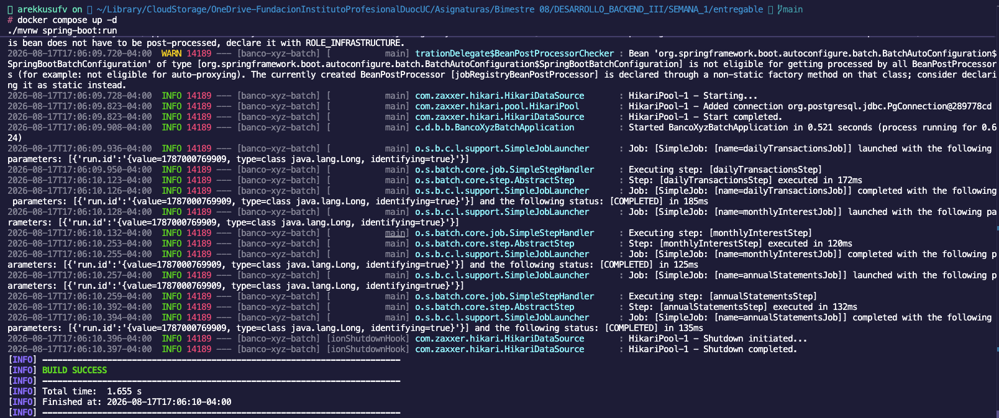
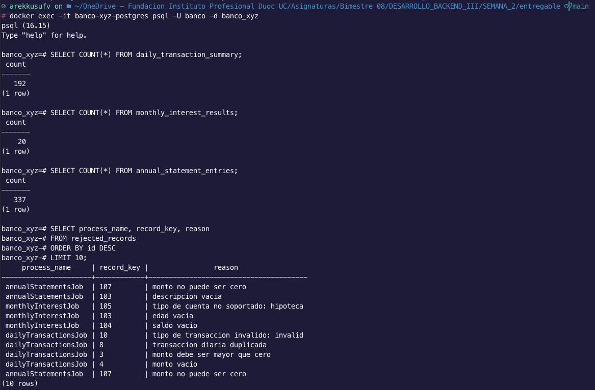
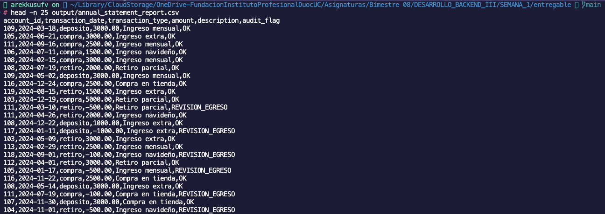

# Banco XYZ Batch

Solucion Semana 3 de Desarrollo Backend III para modernizar tres procesos legacy del Banco XYZ con Spring Batch:

- Reporte de transacciones diarias.
- Calculo de intereses mensuales.
- Generacion de estados de cuenta anuales.

La implementacion aplica procesamiento por chunks, tolerancia a fallos personalizada, registro de rechazos, ejecucion paralela con 3 hilos y particionamiento manager/worker para el proceso anual.
Tambien incorpora una decision operativa al cierre de cada Job para distinguir ejecuciones limpias, ejecuciones con omisiones controladas y casos que requieren revision.

## Base de datos 

Se utiliza **PostgreSQL con Docker Compose**. 

## Ejecutar

Requisitos:

- Java 17.
- Docker Desktop o Docker Compose.
- Puerto local `5432` disponible para PostgreSQL.

```bash
docker compose up -d
./mvnw spring-boot:run
```

Si no tienes Maven Wrapper generado, usa:

```bash
mvn spring-boot:run
```

Por defecto se procesan los CSV de `src/main/resources/input/semana_3`. Para cambiar semana:

```bash
mvn spring-boot:run -Dspring-boot.run.arguments="--legacy.data.week=semana_1"
```

Parametros batch principales:

```properties
legacy.data.week=semana_3
batch.chunk-size=5
batch.thread-pool-size=3
batch.partition-grid-size=3
batch.skip-limit=10
batch.retry-limit=2
batch.review-skip-threshold=3
```

Configuracion minima de base de datos:

```properties
spring.datasource.url=jdbc:postgresql://localhost:5432/banco_xyz
spring.datasource.username=banco
spring.datasource.password=banco
```

El archivo `src/main/resources/schema.sql` crea automaticamente las tablas de salida cuando inicia la aplicacion.

## Resultados

Los datos limpios se escriben en PostgreSQL:

- `daily_transaction_summary`
- `monthly_interest_results`
- `annual_statement_entries`
- `rejected_records`

Ademas, el job anual genera `output/annual_statement_report.csv`.

## Verificacion rapida

Despues de ejecutar la aplicacion, se puede validar la persistencia con:

```bash
docker exec -it banco-xyz-postgres psql -U banco -d banco_xyz
```

```sql
SELECT COUNT(*) FROM daily_transaction_summary;
SELECT COUNT(*) FROM monthly_interest_results;
SELECT COUNT(*) FROM annual_statement_entries;
SELECT process_name, record_key, reason
FROM rejected_records
ORDER BY id;
```

Para revisar los rechazos mas recientes:

```bash
docker exec banco-xyz-postgres psql -U banco -d banco_xyz -c "SELECT process_name, record_key, reason FROM rejected_records ORDER BY id DESC LIMIT 10;"
```

La consola tambien imprime un resumen por cada Job con registros leidos, escritos, filtrados, skips tecnicos, commits, rollbacks, tabla de salida, rechazos de esa ejecucion y decision operativa final. Ese resumen permite trazar rapidamente que se leyo, que se transformo, que quedo persistido y si el resultado puede cerrarse o debe revisarse.

## Propuesta tecnica Semana 3

El sistema reescribe tres procesos legacy del Banco XYZ con Spring Batch, manteniendo cada flujo como un Job independiente para separar responsabilidades operativas y facilitar la trazabilidad.

La estrategia de escalamiento combina dos enfoques:

- **Multithreading por chunks** en transacciones diarias e intereses mensuales, porque son procesos acotados por periodo diario o mensual.
- **Particionamiento manager/worker** en estados de cuenta anuales, porque en un escenario bancario real este archivo concentra la mayor volumetria al consolidar movimientos historicos de todo el año por cuenta.

El proceso anual se divide en rangos de lineas mediante `AnnualStatementPartitioner`. Cada particion recibe `start` y `end` en el `ExecutionContext`, y `annualStatementsWorkerStep` procesa solo ese segmento del CSV. La ejecucion paralela de particiones queda a cargo de `TaskExecutorPartitionHandler`, usando `batch.partition-grid-size` para la cantidad de particiones y `batch.thread-pool-size` para los workers disponibles.

Esta decision permite reducir tiempos de procesamiento en el flujo anual, aislar mejor el trabajo por rangos y conservar las mismas reglas de validacion, tolerancia a fallos, retry y auditoria de rechazos usadas en el resto del proyecto.

## Caracteristicas Semana 3

- **Tres Jobs independientes:** `dailyTransactionsJob`, `monthlyInterestJob` y `annualStatementsJob`.
- **Chunks de tamano 5:** configurados mediante `batch.chunk-size=5`.
- **Escalamiento con 3 hilos:** `ThreadPoolTaskExecutor` usa `batch.thread-pool-size=3`.
- **Particionamiento anual:** `annualStatementsJob` ejecuta `annualStatementsPartitionStep`, que divide `cuentas_anuales.csv` en rangos y lanza workers en paralelo.
- **ExecutionContext:** cada worker anual recibe `start`, `end` y `partitionName` para procesar solo su parte del archivo.
- **Lectura segura en paralelo:** los CSV se leen con readers propios en memoria que implementan `ItemReader`; el reader anual tambien soporta rangos para particionamiento.
- **Tolerancia a fallos:** cada Step usa `.faultTolerant()` con `BankRecordSkipPolicy`.
- **Politica personalizada:** `BankRecordSkipPolicy` permite omitir errores controlados de lectura/formato dentro de un limite configurable.
- **Retry configurable:** los reintentos ante `TransientDataAccessException` usan `batch.retry-limit`, por lo que el limite no queda fijo en el codigo.
- **Decision operativa final:** `BankJobCompletionDecider` evalua el estado del Step y sus skips para clasificar el cierre como `COMPLETED`, `COMPLETED_WITH_SKIPS`, `REVIEW_REQUIRED` o `FAILED`.
- **Trazabilidad de errores:** los rechazos de negocio y omisiones batch se guardan en `rejected_records`.
- **Writer anual concurrente:** `AnnualStatementReportWriter` sincroniza la escritura de `output/annual_statement_report.csv`.

## Evidencias de ejecucion

### Consola de ejecucion

La siguiente captura muestra la ejecucion de la aplicacion Spring Batch y la finalizacion de los Jobs.



### Resultados en PostgreSQL

La siguiente captura muestra la conexion al contenedor PostgreSQL, las tablas creadas, muestras de datos procesados y los conteos finales.



### Reporte anual generado

La siguiente captura muestra el archivo `output/annual_statement_report.csv`, generado por `annualStatementsJob`.



## Flujo Batch

La aplicacion ejecuta tres Jobs independientes. Cada Job tiene un Step principal que sigue la estructura clasica de Spring Batch:

```text
CSV legacy -> ItemReader -> ItemProcessor -> ItemWriter -> salida final
```

Los procesos diario y mensual se ejecutan con chunks de 5 registros y un pool de 3 hilos:

```text
CSV legacy -> ItemReader sincronizado en memoria -> ItemProcessor -> ItemWriter
                                     \-> faultTolerant + BankRecordSkipPolicy
                                     \-> retryLimit configurable
                                     \-> TaskExecutor de 3 hilos
                                     \-> BankJobCompletionDecider
```

### Trazabilidad general

| Job | Entrada CSV | Estrategia | Processor | Writer | Salida persistida |
| --- | --- | --- | --- | --- | --- |
| `dailyTransactionsJob` | `input/{semana}/transacciones.csv` | Chunk multithread | `DailyTransactionProcessor` | `transactionWriter` | `daily_transaction_summary` |
| `monthlyInterestJob` | `input/{semana}/intereses.csv` | Chunk multithread | `MonthlyInterestProcessor` | `interestWriter` | `monthly_interest_results` |
| `annualStatementsJob` | `input/{semana}/cuentas_anuales.csv` | Particiones manager/worker | `AnnualStatementProcessor` | `AnnualStatementReportWriter` | `annual_statement_entries` y `output/annual_statement_report.csv` |

### Job 1: Reporte de Transacciones Diarias

```text
src/main/resources/input/{semana}/transacciones.csv
    |
    v
transactionReader
    |
    v
DailyTransactionProcessor
    |-- valida fecha
    |-- valida monto mayor que cero
    |-- valida tipo debito/credito
    |-- omite duplicados
    |-- marca anomalias por monto alto
    |-- registra rechazos en rejected_records
    |
    v
transactionWriter
    |
    v
daily_transaction_summary
```

### Job 2: Calculo de Intereses Mensuales

```text
src/main/resources/input/{semana}/intereses.csv
    |
    v
interestReader
    |
    v
MonthlyInterestProcessor
    |-- valida cuenta
    |-- valida saldo mayor que cero
    |-- valida edad en rango
    |-- valida tipo ahorro/prestamo
    |-- omite cuentas duplicadas
    |-- calcula interes y saldo final
    |-- registra rechazos en rejected_records
    |
    v
interestWriter
    |
    v
monthly_interest_results
```

### Job 3: Generacion de Estados de Cuenta Anuales

```text
src/main/resources/input/{semana}/cuentas_anuales.csv
    |
    v
AnnualStatementPartitioner
    |-- annualPartition0: start/end
    |-- annualPartition1: start/end
    |-- annualPartition2: start/end
    |
    v
TaskExecutorPartitionHandler
    |
    v
annualStatementsWorkerStep
    |
    v
annualReader por rango
    |
    v
AnnualStatementProcessor
    |-- valida fecha
    |-- valida descripcion obligatoria
    |-- valida monto distinto de cero
    |-- valida tipo de movimiento
    |-- omite movimientos duplicados
    |-- marca egresos para revision
    |-- registra rechazos en rejected_records
    |
    v
AnnualStatementReportWriter
    |
    +--> annual_statement_entries
    |
    +--> output/annual_statement_report.csv
```

### Orquestacion

`JobLauncherRunner` ejecuta los Jobs en este orden, usando un `run.id` unico para permitir reejecuciones:

```text
dailyTransactionsJob
    |
    v
monthlyInterestJob
    |
    v
annualStatementsJob
    |
    v
annualStatementsPartitionStep
    |
    v
annualStatementsWorkerStep por particion
```

Cada Job ejecuta su Step principal o Step particionado y luego pasa por `BankJobCompletionDecider`:

```text
Job -> Step -> BankJobCompletionDecider -> estado operativo
```

Los estados operativos son:

- `COMPLETED`: el Step termino sin skips tecnicos.
- `COMPLETED_WITH_SKIPS`: el Step termino con skips tecnicos bajo el umbral de revision.
- `REVIEW_REQUIRED`: los skips tecnicos alcanzan o superan `batch.review-skip-threshold`.
- `FAILED`: el Step termina con estado fallido.

En los datos actuales de Semana 3, las filas invalidas de negocio son procesadas por los `ItemProcessor`, se registran en `rejected_records` y retornan `null`; por eso aparecen como `filtrados` en Spring Batch, no como `skips`. Los `skips` quedan reservados para errores tecnicos controlados durante lectura, procesamiento o escritura.

## Reglas de consistencia

- Fechas: se aceptan solo formatos con año primero:
  - `yyyy-MM-dd`, ejemplo `2024-03-04`.
  - `yyyy/MM/dd`, ejemplo `2024/03/04`.
- Fechas en formato `dd-MM-yyyy` o `dd/MM/yyyy` se rechazan.
- Duplicados: omite registros repetidos por clave natural.
- Montos: rechaza montos nulos, cero o negativos cuando el proceso requiere movimientos positivos.
- Transacciones: acepta tipos esperados por proceso.
- Intereses: acepta solo cuentas `ahorro` y `prestamo`; rechaza edades fuera de rango y saldos invalidos.

Los rechazos se guardan en `rejected_records` con proceso, clave, motivo y payload original para auditoria.

Ademas, los errores omitidos por Spring Batch en etapas de lectura, procesamiento o escritura son registrados por `BankSkipListener` en la misma tabla para mantener una trazabilidad centralizada.

## Politica de finalizacion y reejecucion

La aplicacion separa tres conceptos:

- **Registros filtrados:** rechazos de negocio detectados por los processors. Se guardan en `rejected_records` y el item retorna `null`.
- **Skips tecnicos:** errores controlados por Spring Batch mediante `.faultTolerant()`, `BankRecordSkipPolicy` y `BankSkipListener`.
- **Decision operativa:** clasificacion final del Job calculada por `BankJobCompletionDecider`.

La configuracion relevante es:

```properties
batch.skip-limit=10
batch.retry-limit=2
batch.review-skip-threshold=3
batch.partition-grid-size=3
```

Con esta configuracion, Spring Batch intenta reintentar fallas transitorias de base de datos hasta 2 veces. Si un Step acumula skips tecnicos bajo el umbral, el Job puede cerrar como `COMPLETED_WITH_SKIPS`. Si alcanza 3 o mas skips tecnicos, el Job cierra como `REVIEW_REQUIRED` para dejar trazable que los datos deben revisarse antes del cierre operativo.

Cada ejecucion usa un parametro `run.id`, por lo que el mismo Job puede volver a ejecutarse sin chocar con una instancia anterior. Las salidas principales usan `ON CONFLICT` para actualizar registros ya existentes cuando corresponde; los rechazos quedan auditados en `rejected_records`.

## Ejemplos de validacion y manejo de errores

### Transacciones diarias

Registro valido:

```csv
1,2024-01-01,1000,debito
```

Transformacion esperada:

```text
transaction_id=1, transaction_date=2024-01-01, amount=1000.00, transaction_type=debito, anomaly=false
```

Registro invalido:

```csv
3,2024-01-03,-200,debito
```

Resultado esperado:

```text
rejected_records.process_name=dailyTransactionsJob
rejected_records.record_key=3
rejected_records.reason=monto debe ser mayor que cero
```

Registro valido con alerta:

```csv
9,2024-01-07,3000,debito
```

Transformacion esperada:

```text
anomaly=true, anomaly_reason=monto sobre limite diario
```

### Intereses mensuales

Registro valido:

```csv
101,John Doe,5000,30,ahorro
```

Transformacion esperada:

```text
monthly_rate=0.0050, interest_amount=25.00, final_balance=5025.00
```

Registro invalido:

```csv
105,Charlie Green,7000,35,hipoteca
```

Resultado esperado:

```text
rejected_records.process_name=monthlyInterestJob
rejected_records.record_key=105
rejected_records.reason=tipo de cuenta no soportado: hipoteca
```

### Estados de cuenta anuales

Registro valido:

```csv
101,2024-03-15,retiro,-500,Retiro parcial
```

Transformacion esperada:

```text
audit_flag=REVISION_EGRESO
```

Registro invalido:

```csv
107,2024-12-25,deposito,0,Ingreso navideno
```

Resultado esperado:

```text
rejected_records.process_name=annualStatementsJob
rejected_records.record_key=107
rejected_records.reason=monto no puede ser cero
```

## Pruebas automatizadas

Los procesadores principales tienen pruebas unitarias para reglas de negocio y rechazos:

```bash
./mvnw test
```

La prueba automatizada tambien cubre el `BankJobCompletionDecider`, validando los escenarios `COMPLETED`, `COMPLETED_WITH_SKIPS` y `REVIEW_REQUIRED`.
