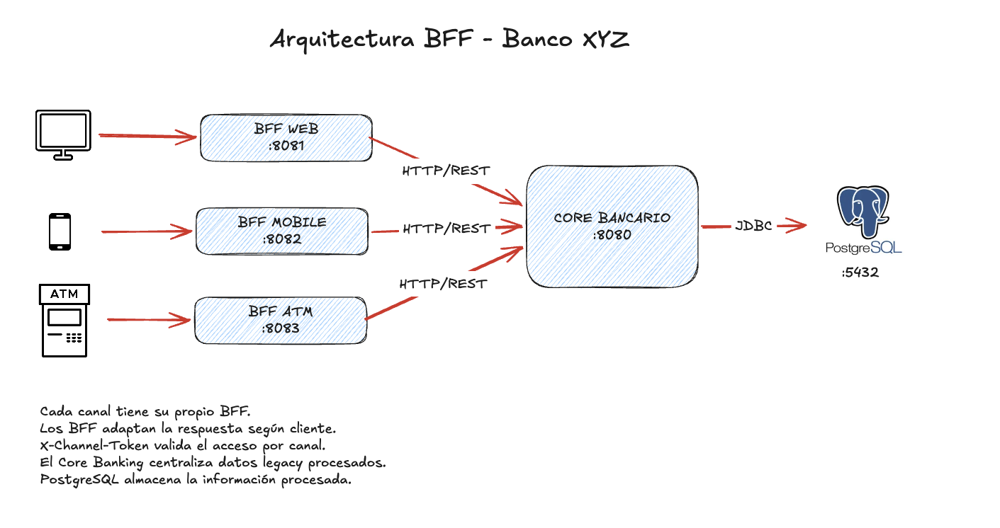
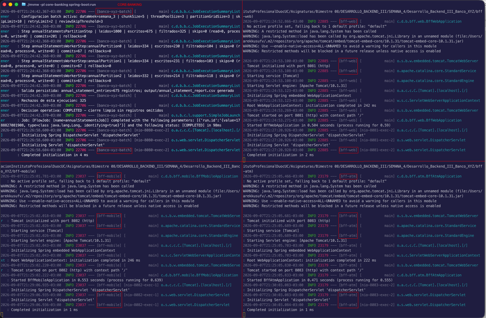
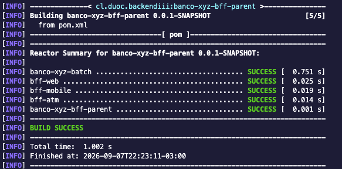
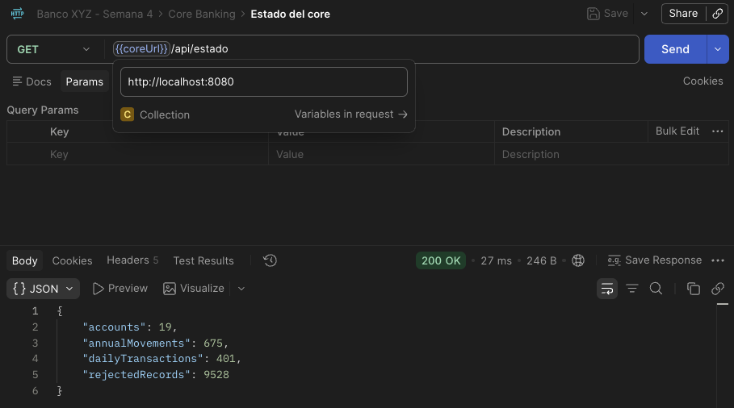
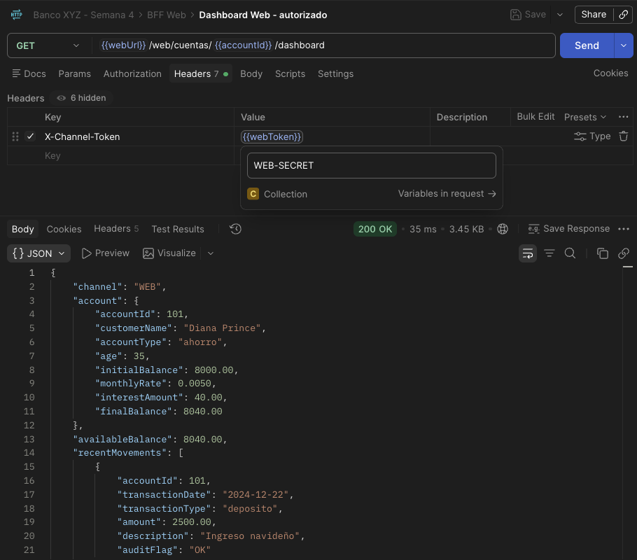
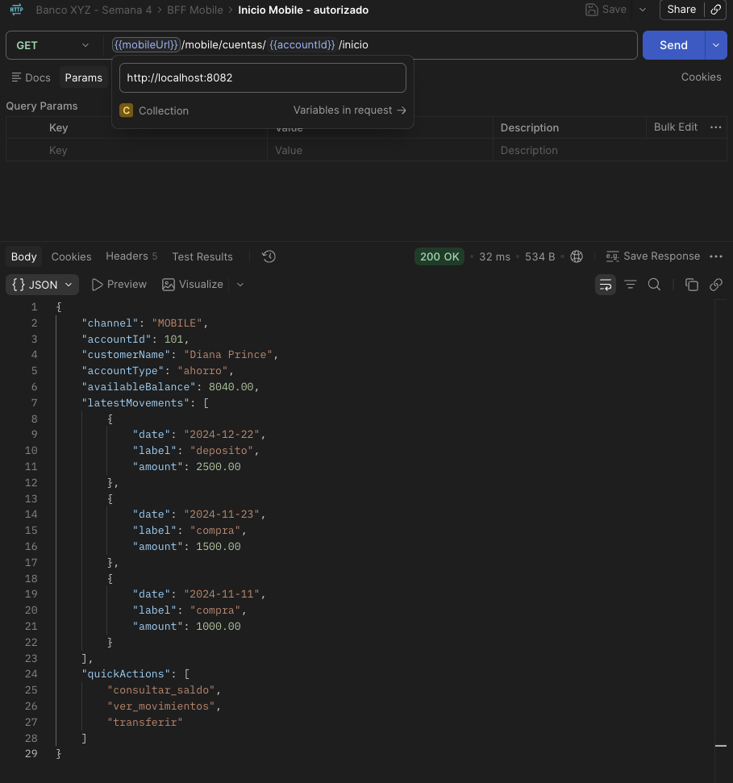
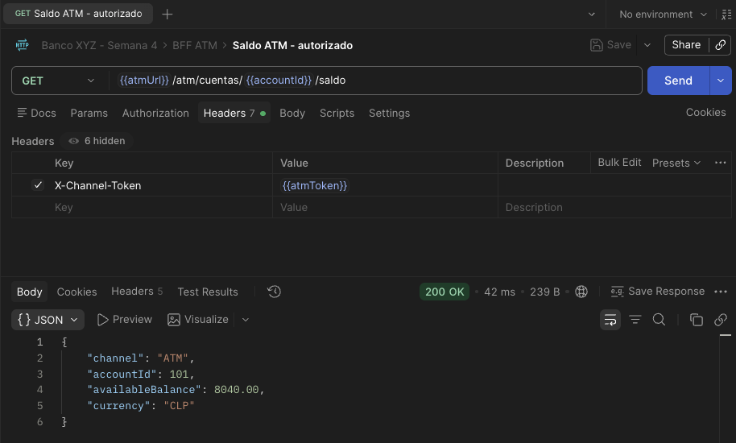
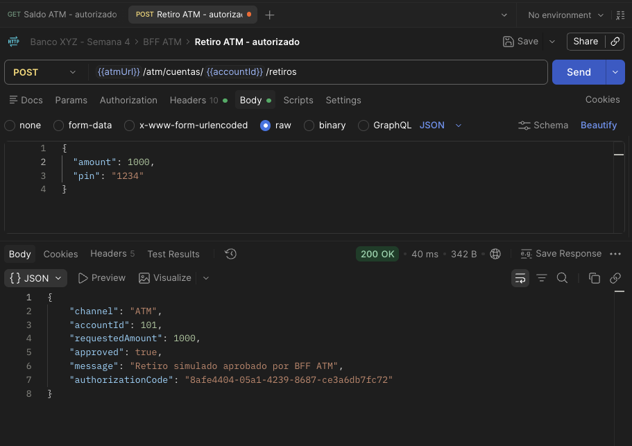
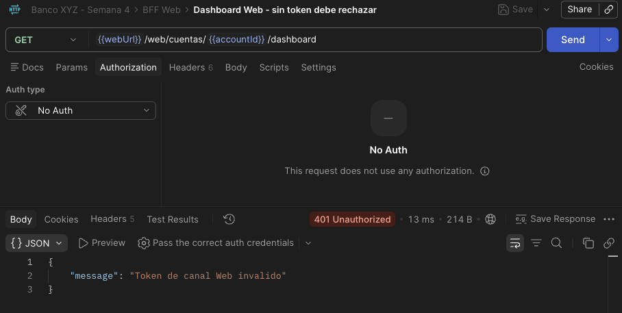
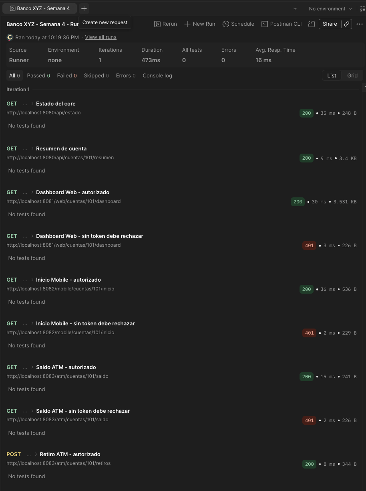

# Banco XYZ BFF

Proyecto formativo de Semana 4 para implementar el patron **Backend for Frontend (BFF)** sobre el backend bancario construido en la continuidad del proyecto Banco XYZ.

El sistema expone un backend central con los datos procesados desde archivos legacy y tres BFF independientes, cada uno adaptado a las necesidades de un canal: web, movil y cajero automatico.

## Objetivo

Implementar una arquitectura BFF que optimice la comunicacion entre distintos clientes del Banco XYZ y el backend central. Cada canal recibe solo la informacion y las operaciones que necesita, reduciendo acoplamiento, payloads innecesarios y reglas duplicadas en los frontends.

## Estrategia BFF

La estrategia seleccionada es **un BFF por canal**. Esta decision permite separar contratos, respuestas y validaciones segun el tipo de cliente.

| Canal | BFF | Proposito |
| --- | --- | --- |
| Web | `bff-web` | Entregar una vista completa para navegadores, con saldo, datos de cuenta, movimientos y alertas operativas. |
| Mobile | `bff-mobile` | Entregar una respuesta liviana con datos esenciales, optimizada para menor consumo y carga rapida. |
| Cajero automatico | `bff-atm` | Entregar operaciones acotadas y seguras para consulta de saldo y retiro simulado. |

## Arquitectura



## Estructura del proyecto

```text
Desarrollo_Backend_III_Banco_XYZ/
|-- core-banking/    Backend central con Spring Batch, PostgreSQL y API REST
|-- bff-web/         BFF para banca web
|-- bff-mobile/      BFF para app movil
|-- bff-atm/         BFF para cajeros automaticos
|-- postman/         Coleccion de prueba de APIs
|-- evidencias/      Capturas de ejecucion para la entrega
|-- docker-compose.yml
|-- pom.xml
```

Cada modulo BFF mantiene el patron de carpetas usado en clase:

```text
controller/
model/
service/
client/
config/
```

En `core-banking` tambien existen paquetes propios del procesamiento batch, como `reader`, `processor`, `writer`, `partition`, `policy` y `listener`.

## Componentes

- `core-banking`: procesa los archivos CSV legacy, persiste resultados en PostgreSQL y expone APIs REST internas.
- `bff-web`: consume el core y arma un dashboard completo para banca web.
- `bff-mobile`: consume el core y arma una vista compacta para aplicacion movil.
- `bff-atm`: consume el core y expone operaciones limitadas para cajeros automaticos.

## Requisitos

- Java 17 o superior.
- Docker y Docker Compose.
- Maven Wrapper incluido en el proyecto.
- Postman para ejecutar la coleccion de validacion.

## Ejecucion

Levantar PostgreSQL:

```bash
docker compose up -d postgres
```

Ejecutar el core bancario:

```bash
./mvnw -pl core-banking spring-boot:run
```

Ejecutar cada BFF en una terminal distinta:

```bash
./mvnw -pl bff-web spring-boot:run
```

```bash
./mvnw -pl bff-mobile spring-boot:run
```

```bash
./mvnw -pl bff-atm spring-boot:run
```

Puertos utilizados:

| Servicio | URL |
| --- | --- |
| Core Banking | `http://localhost:8080` |
| BFF Web | `http://localhost:8081` |
| BFF Mobile | `http://localhost:8082` |
| BFF ATM | `http://localhost:8083` |

## Pruebas

Ejecutar la suite completa:

```bash
./mvnw test
```

La coleccion Postman esta disponible en:

```text
postman/Banco_XYZ_Semana_4.postman_collection.json
```

La coleccion contiene pruebas para el core bancario y los tres BFF. Incluye casos autorizados con `X-Channel-Token` y casos sin token para comprobar el rechazo `401` por canal.

## API del core bancario

```bash
curl http://localhost:8080/api/estado
curl http://localhost:8080/api/cuentas
curl http://localhost:8080/api/cuentas/101
curl http://localhost:8080/api/cuentas/101/resumen
curl http://localhost:8080/api/cuentas/101/saldo
curl "http://localhost:8080/api/cuentas/101/movimientos?limit=5"
curl "http://localhost:8080/api/transacciones?onlyAnomalies=true&limit=5"
curl "http://localhost:8080/api/rechazos?limit=5"
```

## APIs BFF

### BFF Web

```bash
curl http://localhost:8081/web/cuentas/101/dashboard \
  -H "X-Channel-Token: WEB-SECRET"
```

Respuesta esperada: dashboard con datos de cuenta, saldo disponible, ultimos movimientos, alertas y secciones visibles para web.

### BFF Mobile

```bash
curl http://localhost:8082/mobile/cuentas/101/inicio \
  -H "X-Channel-Token: MOBILE-SECRET"
```

Respuesta esperada: resumen liviano con saldo, datos principales de cuenta, ultimos movimientos y acciones rapidas.

### BFF ATM

```bash
curl http://localhost:8083/atm/cuentas/101/saldo \
  -H "X-Channel-Token: ATM-SECRET"
```

```bash
curl -X POST http://localhost:8083/atm/cuentas/101/retiros \
  -H "Content-Type: application/json" \
  -H "X-Channel-Token: ATM-SECRET" \
  -d '{"amount":1000,"pin":"1234"}'
```

Respuesta esperada: consulta de saldo o retiro simulado aprobado cuando el monto y el PIN cumplen las reglas del canal.

## Autenticacion y autorizacion por canal

Cada BFF valida el header `X-Channel-Token` antes de atender sus rutas. Se usa un token distinto por canal para representar que Web, Mobile y ATM son clientes diferentes y no comparten exactamente el mismo contrato de acceso.

Tokens locales por defecto:

| Canal | Header requerido |
| --- | --- |
| Web | `X-Channel-Token: WEB-SECRET` |
| Mobile | `X-Channel-Token: MOBILE-SECRET` |
| ATM | `X-Channel-Token: ATM-SECRET` |

Esta solucion es intencionalmente simple para el alcance academico del proyecto: permite evidenciar autenticacion y autorizacion especificas por canal sin agregar la complejidad completa de OAuth2 o JWT.

En un escenario productivo, estos tokens deberian reemplazarse por un proveedor de identidad, expiracion de credenciales, scopes por canal y auditoria centralizada. El BFF ATM agrega ademas validacion de `pin`, ya que ese canal ejecuta operaciones criticas.

## Validaciones sugeridas

| Validacion | Resultado esperado |
| --- | --- |
| `./mvnw test` | `BUILD SUCCESS` |
| `GET /api/estado` | `200 OK` |
| Web sin `X-Channel-Token` | `401 Unauthorized` |
| Web con `WEB-SECRET` | `200 OK` |
| Mobile sin `X-Channel-Token` | `401 Unauthorized` |
| Mobile con `MOBILE-SECRET` | `200 OK` |
| ATM sin `X-Channel-Token` | `401 Unauthorized` |
| ATM con `ATM-SECRET` | `200 OK` |
| Retiro ATM con token, monto y PIN valido | `200 OK` con retiro aprobado |

## Evidencia de ejecucion

Las siguientes capturas documentan la ejecucion del sistema y la validacion de los endpoints solicitados.

### Servicios levantados



### Pruebas automatizadas



### Core bancario



### BFF Web



### BFF Mobile



### BFF ATM





### Autenticacion por canal



### Coleccion Postman


