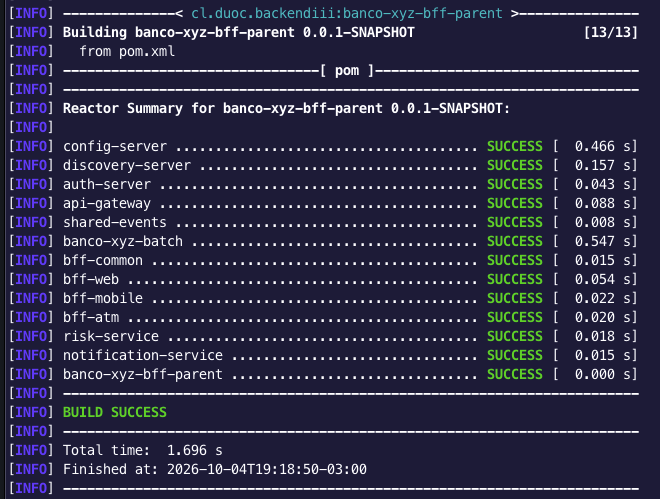
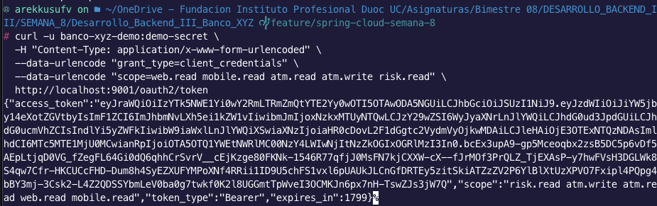
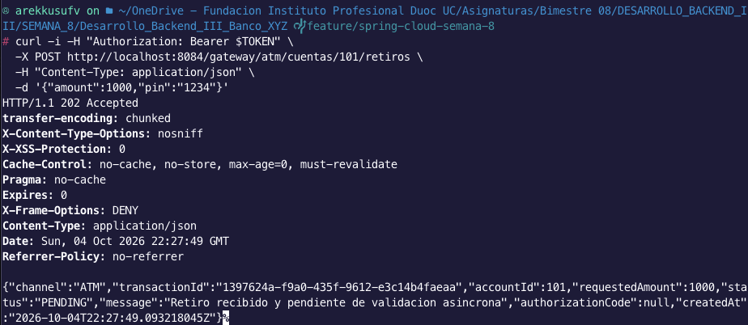
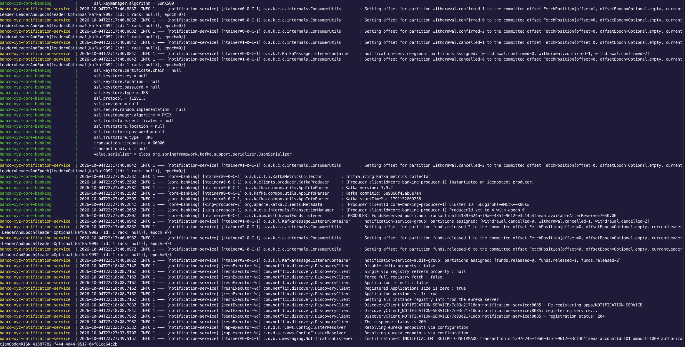
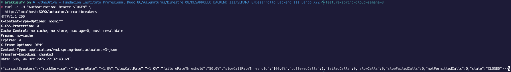
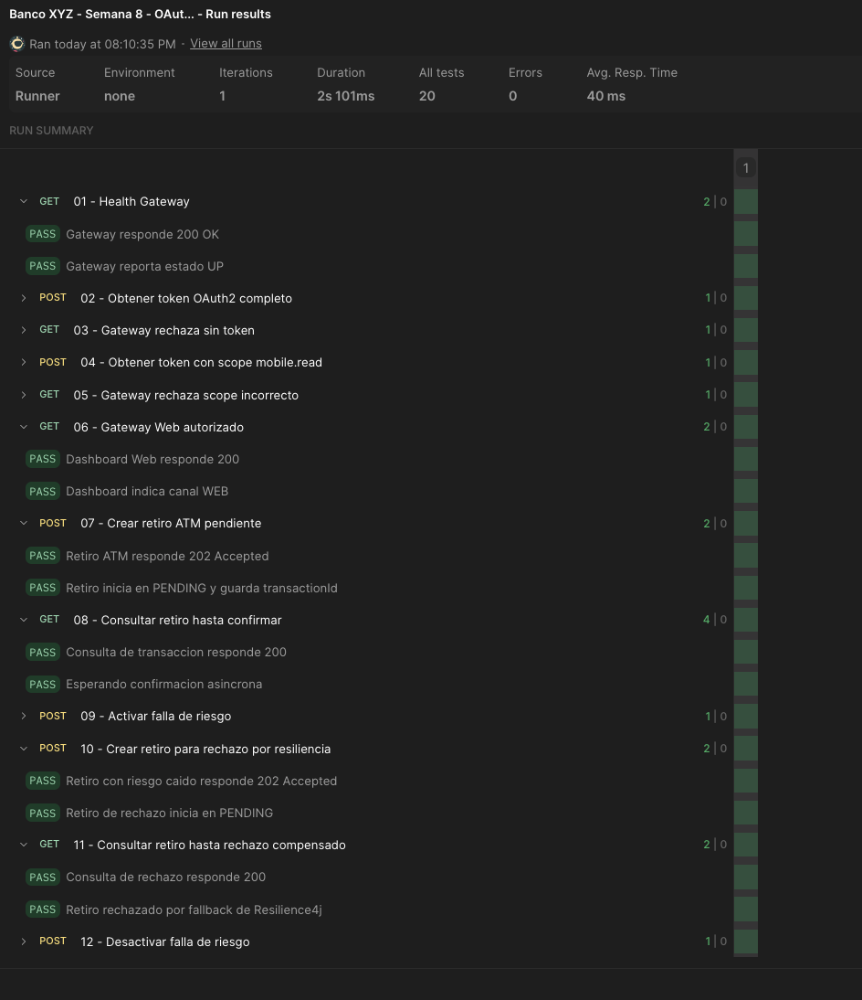

# Banco XYZ - Semana 8

Proyecto final de Desarrollo Backend III para implementar una arquitectura de microservicios segura, resiliente y orientada a eventos con Spring Cloud.

La solucion incorpora OAuth2.0/JWT, Docker, Docker Compose, Resilience4j y Kafka sobre el sistema Banco XYZ. El flujo principal validado es el retiro por canal ATM, procesado de forma asincrona mediante eventos y compensacion ante rechazo de riesgo.

## Objetivo

Preparar los microservicios de Banco XYZ para un entorno cloud resiliente y seguro:

- Proteger servicios con OAuth2.0 y JWT.
- Dockerizar todos los microservicios.
- Orquestar la solucion completa con Docker Compose.
- Mantener tolerancia a fallos con Resilience4j.
- Integrar mensajeria asincrona con Kafka.
- Documentar ejecucion, pruebas y evidencias.

## Arquitectura


```text
Cliente / Postman
       |
       v
API Gateway :8084
       |
       +--> BFF Web :8081
       +--> BFF Mobile :8082
       +--> BFF ATM :8083
                |
                v
          Core Banking :8080
                |
                v
           PostgreSQL :5432

Auth Server :9000       OAuth2 + JWT + JWK
Config Server :8888     configuracion centralizada
Eureka :8761            service discovery
Kafka :9092             eventos de retiro y compensacion
Risk Service :8090      evaluacion de riesgo + Resilience4j
Notification :8085      notificacion y auditoria de eventos
```

## Componentes

| Modulo | Proposito |
| --- | --- |
| `auth-server` | Servidor OAuth2.0 con flujo `client_credentials`, emision JWT y JWK Set. |
| `api-gateway` | Entrada unica a los BFF, validando bearer token y scopes. |
| `bff-web` | Canal Web para dashboard de cuenta. |
| `bff-mobile` | Canal Mobile para vista liviana de cuenta. |
| `bff-atm` | Canal ATM para saldo, retiro y seguimiento de transacciones. |
| `core-banking` | Backend central, API bancaria, batch legacy, PostgreSQL y reserva/liberacion de fondos. |
| `risk-service` | Evaluacion de riesgo de retiros y fallback con Resilience4j. |
| `notification-service` | Consumidor de eventos finales y auditoria. |
| `shared-events` | Contratos compartidos para eventos Kafka. |
| `config-server` | Configuracion centralizada para microservicios. |
| `discovery-server` | Registro Eureka para descubrimiento de servicios. |

## Requisitos

- Java 21.
- Docker y Docker Compose.
- Maven Wrapper incluido.
- Postman para ejecutar la coleccion de validacion.

## Ejecucion

Levantar la solucion completa:

```bash
docker compose up -d --build
```

Si el puerto `9000` esta ocupado, publicar `auth-server` en otro puerto del host:

```bash
AUTH_SERVER_PORT=9001 docker compose up -d --build
export AUTH_SERVER_PORT=9001
```

La variable `AUTH_SERVER_PORT` solo cambia el puerto expuesto en el host. Dentro de Docker, los servicios siguen usando `http://auth-server:9000`.

Revisar contenedores:

```bash
docker compose ps
```

Detener el ambiente:

```bash
docker compose down
```

Detener y eliminar datos locales de PostgreSQL:

```bash
docker compose down -v
```

## Puertos

| Servicio | URL |
| --- | --- |
| Auth Server | `http://localhost:${AUTH_SERVER_PORT:-9000}` |
| API Gateway | `http://localhost:8084` |
| BFF Web | `http://localhost:8081` |
| BFF Mobile | `http://localhost:8082` |
| BFF ATM | `http://localhost:8083` |
| Core Banking | `http://localhost:8080` |
| Risk Service | `http://localhost:8090` |
| Notification Service | `http://localhost:8085` |
| Config Server | `http://localhost:8888` |
| Eureka | `http://localhost:8761` |
| PostgreSQL | `localhost:5432` |
| Kafka | `localhost:29092` para clientes locales, `kafka:9092` dentro de Docker |

## Seguridad OAuth2

`auth-server` emite JWT mediante `client_credentials`. Gateway, BFFs, Core Banking y Risk Service validan bearer tokens.

| Cliente | Secreto | Scopes |
| --- | --- | --- |
| `banco-xyz-demo` | `demo-secret` | `web.read`, `mobile.read`, `atm.read`, `atm.write`, `risk.read` |
| `bff-web` | `bff-web-secret` | `core.read` |
| `bff-mobile` | `bff-mobile-secret` | `core.read` |
| `bff-atm` | `bff-atm-secret` | `core.read`, `core.write` |

Rutas principales protegidas:

| Componente | Ruta | Scope |
| --- | --- | --- |
| `api-gateway` | `/gateway/web/**` | `web.read` |
| `api-gateway` | `/gateway/mobile/**` | `mobile.read` |
| `api-gateway` | `/gateway/atm/**` | `atm.read` o `atm.write` |
| `core-banking` | `/api/**` | `core.read` o `core.write` |
| `risk-service` | `/api/risk/admin/**` | `risk.read` |

Obtener token de laboratorio:

```bash
curl -u banco-xyz-demo:demo-secret \
  -H "Content-Type: application/x-www-form-urlencoded" \
  --data-urlencode "grant_type=client_credentials" \
  --data-urlencode "scope=web.read mobile.read atm.read atm.write risk.read" \
  http://localhost:${AUTH_SERVER_PORT:-9000}/oauth2/token
```

Usar token:

```bash
curl -H "Authorization: Bearer $TOKEN" \
  http://localhost:8084/gateway/web/cuentas/101/dashboard
```

Resultados esperados:

| Caso | Resultado |
| --- | --- |
| Sin bearer token | `401 Unauthorized` |
| Token valido sin scope requerido | `403 Forbidden` |
| Token valido con scope requerido | `200 OK` |

## Flujo ATM Asincrono

El retiro ATM se procesa como saga coreografiada con Kafka.

```text
bff-atm
  -> withdrawal.requested
core-banking
  -> funds.reserved
risk-service
  -> risk.approved / risk.rejected
bff-atm
  -> withdrawal.confirmed / withdrawal.cancelled
notification-service
  -> notificacion y auditoria
```

Si el riesgo rechaza una transaccion o se activa el fallback de Resilience4j, `bff-atm` publica `funds.release-requested` y `core-banking` responde con `funds.released`.

## Pruebas

Ejecutar pruebas automatizadas:

```bash
./mvnw test
```

Coleccion Postman:

```text
postman/Banco_XYZ_Semana_8.postman_collection.json
```

Para usarla:

1. Levantar Docker Compose.
2. Importar la coleccion en Postman.
3. Ajustar `authBaseUrl` si se uso `AUTH_SERVER_PORT=9001`.
4. Ejecutar la coleccion completa con Collection Runner.

La coleccion valida:

- Health del Gateway.
- Emision de token OAuth2.
- Respuesta `401` sin token.
- Respuesta `403` con scope incorrecto.
- Acceso autorizado por Gateway.
- Retiro ATM `PENDING -> CONFIRMED`.
- Rechazo por falla simulada de riesgo.
- Compensacion y restauracion de `risk-service`.

## Evidencias

Las evidencias oficiales estan en `evidencias/`.

### 00 - Arquitectura


### 01 - Servicios levantados


### 02 - Pruebas Maven



### 03 - Token OAuth2



### 04 - Rechazo sin token


### 05 - Rechazo por scope incorrecto


### 06 - Gateway autorizado


### 07 - Retiro ATM pendiente



### 08 - Retiro ATM confirmado


### 09 - Logs Kafka



### 10 - Resilience4j



### 11 - Collection Runner Postman



## Checklist de Entrega

| Criterio Semana 8 | Estado |
| --- | --- |
| OAuth2.0 funcional | Cumplido con `auth-server`, JWT, scopes y Resource Servers. |
| Imagenes Docker para microservicios | Cumplido con Dockerfile por servicio. |
| Docker Compose funcional | Cumplido con PostgreSQL, Kafka y microservicios orquestados. |
| Resilience4j | Cumplido en `risk-service` con fallback de rechazo y compensacion. |
| Kafka o JMS | Cumplido con Kafka y saga de retiro ATM. |
| Codigo, README y evidencias | Cumplido en repo, README y carpeta `evidencias/`. |
