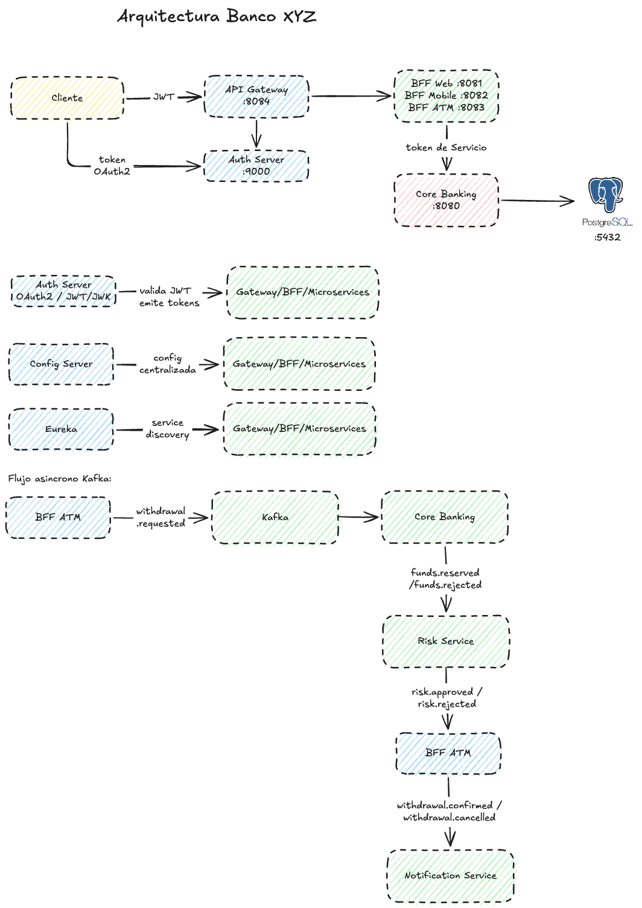
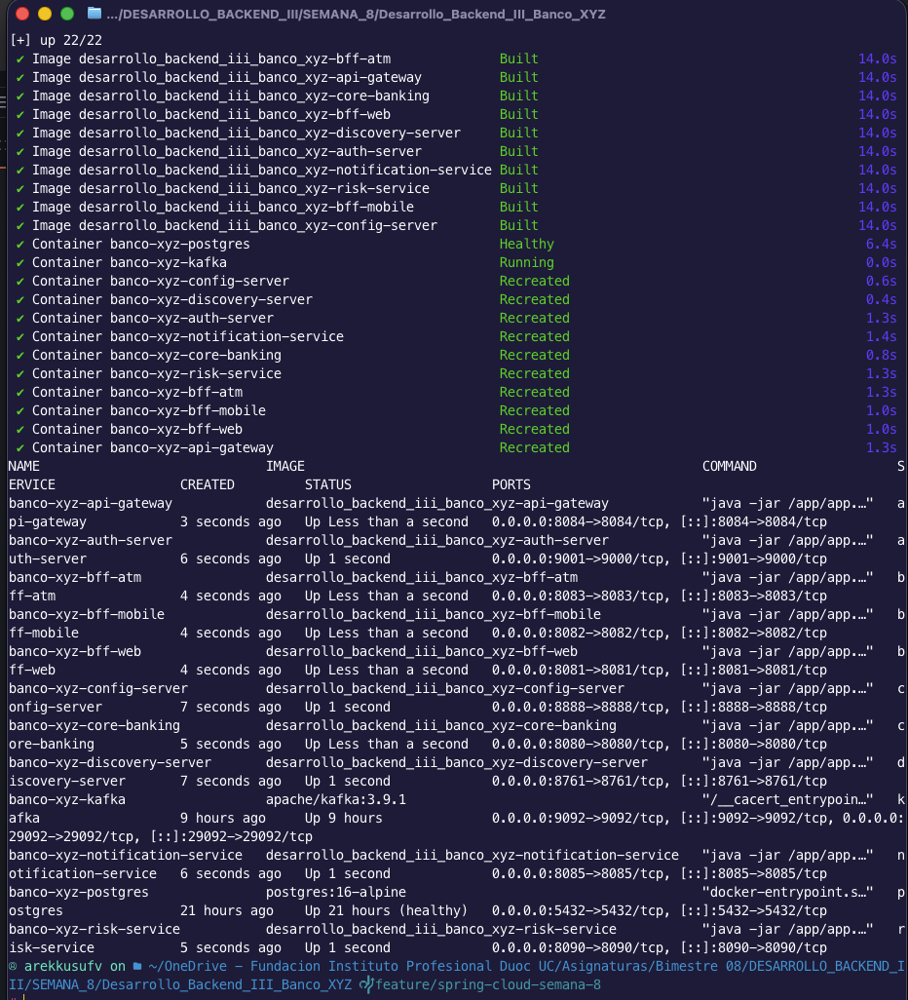
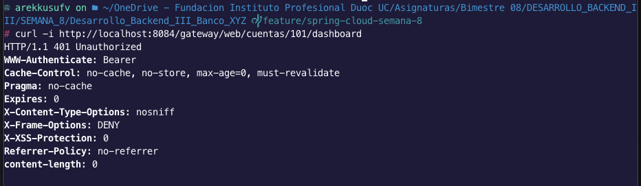
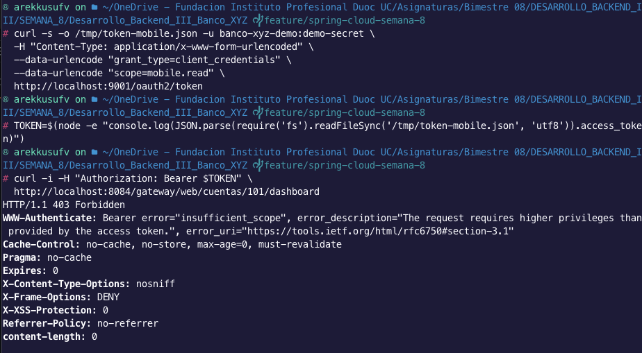
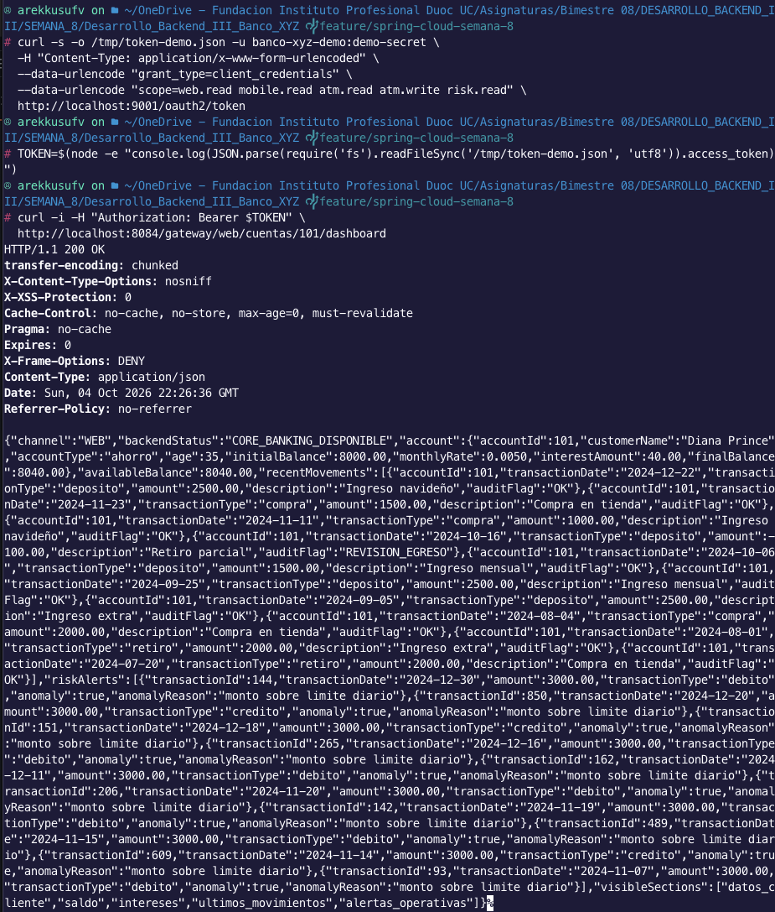
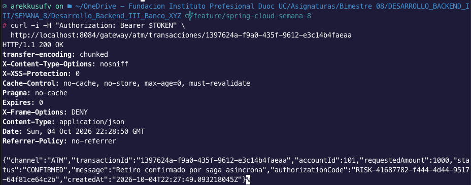

# Banco XYZ Spring Cloud Seguro y Eventos

Proyecto formativo de Semana 8 para evolucionar el sistema Banco XYZ hacia una arquitectura de microservicios con **Spring Cloud Config Server**, **Eureka Service Discovery**, **Spring Cloud Gateway**, seguridad **OAuth2.0/JWT**, tolerancia a fallos con **Resilience4j** y mensajeria asincrona con **Kafka**.

El sistema mantiene el backend central con los datos procesados desde archivos legacy y los tres BFF independientes por canal construidos en semanas anteriores. En esta version, el retiro del canal ATM se procesa mediante una saga coreografiada basada en eventos.

## Objetivo

Implementar una arquitectura distribuida para Banco XYZ usando Spring Cloud, manteniendo la separacion por canales BFF e incorporando configuracion centralizada, descubrimiento de servicios, entrada por Gateway, autenticacion/autorizacion OAuth2.0, resiliencia ante fallas y procesamiento asincrono de transacciones mediante Kafka.

## Evolucion Semana 6

La actividad pide:

- Configurar un servidor centralizado de configuracion consumido por al menos un microservicio.
- Habilitar Service Discovery y registrar al menos un microservicio.
- Implementar un microservicio con tolerancia a fallos y autenticacion.

Este proyecto cumple esos puntos asi:

| Requisito | Implementacion |
| --- | --- |
| Config Server | Modulo `config-server` en puerto `8888`, con repositorio nativo en `config-repo`. |
| Service Discovery | Modulo `discovery-server` con Eureka en puerto `8761`. |
| Microservicio registrado | `core-banking`, `bff-web`, `bff-mobile`, `bff-atm` y `api-gateway`. |
| Tolerancia a fallos | Circuit Breaker en `bff-web` para el dashboard cuando `core-banking` no responde. |
| Seguridad | Spring Security como base de autenticacion y autorizacion por canal. |
| Gateway | Modulo `api-gateway` en puerto `8084`, enruta hacia los BFF mediante Eureka. |

## Evolucion Semana 7

La actividad pide configurar tolerancia a fallos y arquitectura de eventos con microservicios en la nube. Este proyecto implementa esa evolucion asi:

| Requisito | Implementacion |
| --- | --- |
| Arquitectura de eventos | Saga coreografiada basada en eventos de dominio. |
| Mensajeria | Apache Kafka en modo KRaft, configurado en `docker-compose.yml`. |
| Transaccion asincrona | Retiro ATM iniciado por `bff-atm` y procesado por `core-banking`, `risk-service` y `notification-service`. |
| Tolerancia a fallos | Circuit Breaker `riskService` en `risk-service`, con fallback que rechaza la transaccion y dispara compensacion. |
| Idempotencia | Cada consumidor guarda `eventId` procesados en memoria para ignorar duplicados. |
| Escalabilidad | Topicos con tres particiones y `notification-service-group` para demostrar consumer groups. |

La decision tecnica es usar **Kafka + Saga coreografiada**. Cada servicio reacciona a eventos publicados por otros servicios sin invocaciones sincronas entre todos los participantes de la transaccion. La compensacion se realiza con `funds.release-requested` cuando el riesgo rechaza una operacion despues de reservar fondos.

## Evolucion Semana 8

La actividad pide implementar OAuth2.0, dockerizar microservicios y orquestar todo con Docker Compose. Este proyecto implementa esa evolucion asi:

| Requisito | Implementacion |
| --- | --- |
| OAuth2.0 | Modulo `auth-server` en puerto interno `9000`, con Authorization Server y flujo `client_credentials`. |
| JWT / JWK | `auth-server` emite JWT firmados con RSA y publica sus llaves para validacion por Resource Servers. |
| Gateway protegido | `api-gateway` exige bearer token y scopes para rutas `/gateway/**`. |
| BFF protegidos | `bff-web`, `bff-mobile` y `bff-atm` validan JWT y scopes por canal. |
| Servicios internos protegidos | `core-banking` y endpoint administrativo de `risk-service` validan JWT. |
| Tokens de servicio | Los BFF obtienen token `client_credentials` para consumir `core-banking`. |
| Docker | Cada microservicio tiene Dockerfile multi-stage con Maven y Eclipse Temurin 21. |
| Compose | `docker-compose.yml` levanta PostgreSQL, Kafka y todos los microservicios. |

Docker Compose expone `auth-server` en `localhost:9000` por defecto. Si ese puerto esta ocupado por una herramienta local, se puede cambiar sin editar el YAML usando `AUTH_SERVER_PORT`, por ejemplo `AUTH_SERVER_PORT=9001 docker compose up -d --build`. Dentro de la red Docker los servicios siempre usan `http://auth-server:9000`.

### Topicos Semana 7

| Topico | Productor | Consumidor | Proposito |
| --- | --- | --- | --- |
| `withdrawal.requested` | `bff-atm` | `core-banking` | Solicitar retiro asincrono. |
| `funds.reserved` | `core-banking` | `risk-service` | Indicar que los fondos fueron reservados. |
| `funds.rejected` | `core-banking` | `bff-atm` | Rechazar por cuenta inexistente, monto invalido o saldo insuficiente. |
| `risk.approved` | `risk-service` | `bff-atm` | Aprobar la operacion por riesgo. |
| `risk.rejected` | `risk-service` | `bff-atm` | Rechazar por riesgo o fallback de Resilience4j. |
| `withdrawal.confirmed` | `bff-atm` | `notification-service` | Notificar retiro confirmado. |
| `withdrawal.cancelled` | `bff-atm` | `notification-service` | Notificar retiro cancelado. |
| `funds.release-requested` | `bff-atm` | `core-banking` | Pedir compensacion de fondos reservados. |
| `funds.released` | `core-banking` | `notification-service` | Registrar liberacion compensatoria. |

El diagrama de la solucion esta en [docs/architecture/semana-7-event-driven-banking.md](docs/architecture/semana-7-event-driven-banking.md).

## Estrategia BFF

La estrategia seleccionada es **un BFF por canal**. Esta decision permite separar contratos, respuestas y validaciones segun el tipo de cliente.

| Canal | BFF | Proposito |
| --- | --- | --- |
| Web | `bff-web` | Entregar una vista completa para navegadores, con saldo, datos de cuenta, movimientos y alertas operativas. |
| Mobile | `bff-mobile` | Entregar una respuesta liviana con datos esenciales, optimizada para menor consumo y carga rapida. |
| Cajero automatico | `bff-atm` | Entregar operaciones acotadas y seguras para consulta de saldo y retiro simulado. |

## Arquitectura


```text
Cliente / Postman
       |
       v
API Gateway :8084
       |
       +--> BFF WEB :8081 ----\
       +--> BFF MOBILE :8082 --+--> CORE BANKING :8080 --> PostgreSQL
       +--> BFF ATM :8083 ----/

Auth Server :9000 --> OAuth2 + JWT + JWK
Config Server :8888 --> configuracion centralizada
Eureka :8761        --> registro y descubrimiento de servicios
```

El flujo de cada BFF mantiene la separacion:

```text
Controller -> Service -> Client -> Core Banking
```

## Estructura del proyecto

```text
Desarrollo_Backend_III_Banco_XYZ/
|-- core-banking/    Backend central con Spring Batch, PostgreSQL y API REST
|-- bff-common/      RestClient compartido y seguridad comun de los BFF
|-- bff-web/         BFF para banca web
|-- bff-mobile/      BFF para app movil
|-- bff-atm/         BFF para cajeros automaticos
|-- shared-events/   Contratos de eventos Kafka compartidos
|-- risk-service/    Servicio de evaluacion de riesgo con Resilience4j
|-- notification-service/ Consumidor de eventos finales y auditoria
|-- config-server/   Configuracion centralizada Spring Cloud
|-- discovery-server/ Registro Eureka para descubrimiento de servicios
|-- auth-server/     Servidor OAuth2 para emision y validacion de JWT
|-- api-gateway/     Entrada unica hacia los BFF con Spring Cloud Gateway
|-- postman/         Coleccion de prueba de APIs
|-- evidencias/      Capturas de ejecucion para la entrega
|-- scripts/         Script para certificado HTTPS de laboratorio
|-- docker-compose.yml
|-- pom.xml
```

Cada modulo BFF mantiene su logica propia en paquetes `controller`, `model`, `service` y `client`. El modulo `bff-common` concentra la configuracion tecnica reutilizable: `RestClient`, validacion JWT, autorizacion por scope, respuestas `401/403` y obtencion de token de servicio para llamar a `core-banking`.

## Requisitos

- Java 21.
- Docker y Docker Compose.
- Maven Wrapper incluido en el proyecto.
- `keytool` disponible en el JDK.
- Postman para ejecutar la coleccion de validacion.

## Certificado HTTPS

Los BFF usan HTTPS con un certificado autofirmado de laboratorio. Para generarlo:

```bash
./scripts/generar-certificados.sh
```

El script copia `keystore.p12` a:

```text
bff-web/src/main/resources/
bff-mobile/src/main/resources/
bff-atm/src/main/resources/
```

La clave local del keystore es `changeit`. Es una credencial didactica y no debe usarse en produccion.

## Ejecucion

Desde la raiz del proyecto, levantar todos los servicios con Docker Compose:

```bash
docker compose up -d --build
```

El comando construye las imagenes cuando existen cambios y deja ejecutando PostgreSQL, Kafka, Core Banking, los tres BFF, Risk Service, Notification Service, Config Server, Eureka, Auth Server y Gateway.

Si el puerto `9000` del host esta ocupado, por ejemplo por SonarQube, levantar el ambiente indicando otro puerto para `auth-server`:

```bash
AUTH_SERVER_PORT=9001 docker compose up -d --build
export AUTH_SERVER_PORT=9001
```

La variable solo cambia el puerto publicado en el host. Entre contenedores, `auth-server` sigue escuchando en `http://auth-server:9000`.

Para revisar el estado de los contenedores:

```bash
docker compose ps
```

Para detener el ambiente:

```bash
docker compose down
```

Si se requiere eliminar tambien los datos locales de PostgreSQL:

```bash
docker compose down -v
```

Cada Dockerfile usa una etapa Maven con Java 21 para compilar el jar dentro de la imagen y una etapa final `eclipse-temurin:21-jre` para ejecutar el servicio. Por eso no es necesario empaquetar los modulos manualmente antes de usar Compose.

Puertos utilizados:

| Servicio | URL |
| --- | --- |
| Kafka | `kafka:9092` dentro de Docker, `localhost:29092` para clientes locales |
| Auth Server | `http://auth-server:9000` dentro de Docker, `http://localhost:${AUTH_SERVER_PORT:-9000}` desde el host |
| Core Banking | `http://localhost:8080` |
| BFF Web | `https://localhost:8081` en ejecucion local directa, `http://localhost:8081` con Docker Compose |
| BFF Mobile | `https://localhost:8082` en ejecucion local directa, `http://localhost:8082` con Docker Compose |
| BFF ATM | `https://localhost:8083` en ejecucion local directa, `http://localhost:8083` con Docker Compose |
| API Gateway | `http://localhost:8084` |
| Notification Service | `http://localhost:8085` |
| Risk Service | `http://localhost:8090` |
| Config Server | `http://localhost:8888` |
| Eureka | `http://localhost:8761` |

En Docker Compose los BFF se ejecutan con `BFF_SSL_ENABLED=false` para que el Gateway pueda enrutar internamente por HTTP sin problemas de certificados autofirmados. La seguridad se mantiene con OAuth2.0, JWT y scopes.

## Clientes OAuth2 de laboratorio

| Cliente | Secreto | Scopes principales | Uso |
| --- | --- | --- | --- |
| `banco-xyz-demo` | `demo-secret` | `web.read`, `mobile.read`, `atm.read`, `atm.write`, `risk.read` | Pruebas desde Postman o curl. |
| `bff-web` | `bff-web-secret` | `core.read` | Token interno para consultar `core-banking`. |
| `bff-mobile` | `bff-mobile-secret` | `core.read` | Token interno para consultar `core-banking`. |
| `bff-atm` | `bff-atm-secret` | `core.read`, `core.write` | Token interno para consultar `core-banking`. |

Las claves se pueden reemplazar con variables de entorno `OAUTH_DEMO_SECRET`, `OAUTH_BFF_WEB_SECRET`, `OAUTH_BFF_MOBILE_SECRET` y `OAUTH_BFF_ATM_SECRET`.

## Seguridad

`auth-server` emite tokens OAuth2.0 con `client_credentials`. `api-gateway`, los BFF, `core-banking` y `risk-service` actuan como Resource Server y validan JWT.

| Componente | Ruta protegida | Scope requerido |
| --- | --- | --- |
| `api-gateway` | `/gateway/web/**` | `web.read` |
| `api-gateway` | `/gateway/mobile/**` | `mobile.read` |
| `api-gateway` | `/gateway/atm/**` | `atm.read` o `atm.write` |
| `bff-web` | `/web/**` | `web.read` |
| `bff-mobile` | `/mobile/**` | `mobile.read` |
| `bff-atm` | `/atm/**` | `atm.read` |
| `core-banking` | `/api/**` | `core.read` o `core.write` |
| `risk-service` | `/api/risk/admin/**` | `risk.read` |

Sin token o con token invalido se responde `401 Unauthorized`. Con token valido pero sin scope suficiente se responde `403 Forbidden`.

Obtener token de laboratorio desde el host:

```bash
curl -u banco-xyz-demo:demo-secret \
  -H "Content-Type: application/x-www-form-urlencoded" \
  --data-urlencode "grant_type=client_credentials" \
  --data-urlencode "scope=web.read mobile.read atm.read atm.write risk.read" \
  http://localhost:${AUTH_SERVER_PORT:-9000}/oauth2/token
```

Usar el valor `access_token` como bearer token:

```bash
curl -H "Authorization: Bearer $TOKEN" \
  http://localhost:8084/gateway/web/cuentas/101/dashboard
```

Para probar `core-banking` directamente se puede obtener un token interno con scope `core.read`:

```bash
curl -u bff-web:bff-web-secret \
  -H "Content-Type: application/x-www-form-urlencoded" \
  --data-urlencode "grant_type=client_credentials" \
  --data-urlencode "scope=core.read" \
  http://localhost:${AUTH_SERVER_PORT:-9000}/oauth2/token
```

## Pruebas

Ejecutar la suite completa:

```bash
./mvnw test
```

La coleccion Postman esta disponible en:

```text
postman/Banco_XYZ_Semana_5.postman_collection.json
postman/Banco_XYZ_Semana_6.postman_collection.json
```

## APIs Spring Cloud Semana 6

### Config Server

```bash
curl http://localhost:8888/bff-web/default
curl http://localhost:8888/core-banking/default
curl http://localhost:8888/api-gateway/default
```

### Eureka

Abrir en navegador:

```text
http://localhost:8761
```

Deberian aparecer, entre otros:

- `CORE-BANKING`
- `BFF-WEB`
- `BFF-MOBILE`
- `BFF-ATM`
- `API-GATEWAY`
- `AUTH-SERVER`

### Gateway

Con Docker Compose:

```bash
curl -H "Authorization: Bearer $TOKEN" http://localhost:8084/gateway/web/cuentas/101/dashboard
curl -H "Authorization: Bearer $TOKEN" http://localhost:8084/gateway/mobile/cuentas/101/inicio
curl -H "Authorization: Bearer $TOKEN" http://localhost:8084/gateway/atm/cuentas/101/saldo
```

### Retiro asincrono Semana 7

Iniciar un retiro ATM por Gateway:

```bash
curl -i -H "Authorization: Bearer $TOKEN" \
  -X POST http://localhost:8084/gateway/atm/cuentas/101/retiros \
  -H "Content-Type: application/json" \
  -d '{"amount":10000,"pin":"1234"}'
```

Resultado esperado: `202 Accepted`, con `transactionId` y estado `PENDING`.

Consultar el estado reemplazando `UUID` por el `transactionId` recibido:

```bash
curl -H "Authorization: Bearer $TOKEN" http://localhost:8084/gateway/atm/transacciones/UUID
```

Resultado esperado para un flujo exitoso: estado `CONFIRMED` y `authorizationCode`.

Para demostrar idempotencia, republicar deliberadamente el mismo `WithdrawalRequested`:

```bash
curl -H "Authorization: Bearer $TOKEN" \
  -X POST http://localhost:8084/gateway/atm/transacciones/UUID/replay-requested
```

En los logs de `core-banking` debe verse un mensaje similar a `WithdrawalRequested duplicado ignorado`.

### Rechazo y compensacion

Activar falla del servicio de riesgo:

```bash
curl -H "Authorization: Bearer $TOKEN" \
  -X POST "http://localhost:8090/api/risk/admin/failure?enabled=true"
```

Crear un retiro nuevo:

```bash
curl -H "Authorization: Bearer $TOKEN" \
  -X POST http://localhost:8084/gateway/atm/cuentas/101/retiros \
  -H "Content-Type: application/json" \
  -d '{"amount":15000,"pin":"1234"}'
```

Resultado esperado: la transaccion pasa a `RISK_REJECTED`, `bff-atm` publica `funds.release-requested`, `core-banking` publica `funds.released` y `notification-service` registra la cancelacion.

Revisar el estado de los Circuit Breakers expuestos por Actuator:

```bash
curl http://localhost:8081/actuator/circuitbreakers
curl http://localhost:8090/actuator/circuitbreakerevents
```

Si el endpoint responde sin instancias registradas o sin eventos, ejecutar primero el flujo de falla anterior y capturar la respuesta degradada del BFF o los logs donde se vea el rechazo/compensacion.

Desactivar la falla:

```bash
curl -H "Authorization: Bearer $TOKEN" \
  -X POST "http://localhost:8090/api/risk/admin/failure?enabled=false"
```

### Consumer groups

Con el primer `notification-service` corriendo en Docker, se puede iniciar otra instancia local:

```bash
INSTANCE_ID=notification-2 KAFKA_BOOTSTRAP_SERVERS=localhost:29092 ./mvnw -pl notification-service spring-boot:run \
  -Dspring-boot.run.arguments="--server.port=8086"
```

Al crear varias transacciones, los mensajes de `withdrawal.confirmed` y `withdrawal.cancelled` se distribuyen dentro del grupo `notification-service-group`.

### Resiliencia

El endpoint web tiene Circuit Breaker:

```bash
curl -H "Authorization: Bearer $TOKEN" http://localhost:8084/gateway/web/cuentas/101/dashboard
```

Si `core-banking` no esta disponible, `bff-web` responde de forma degradada con:

```json
{
  "channel": "WEB",
  "backendStatus": "CORE_BANKING_NO_DISPONIBLE_CIRCUIT_BREAKER"
}
```

## API del core bancario

```bash
curl -H "Authorization: Bearer $CORE_TOKEN" http://localhost:8080/api/estado
curl -H "Authorization: Bearer $CORE_TOKEN" http://localhost:8080/api/cuentas
curl -H "Authorization: Bearer $CORE_TOKEN" http://localhost:8080/api/cuentas/101
curl -H "Authorization: Bearer $CORE_TOKEN" http://localhost:8080/api/cuentas/101/resumen
curl -H "Authorization: Bearer $CORE_TOKEN" http://localhost:8080/api/cuentas/101/saldo
curl -H "Authorization: Bearer $CORE_TOKEN" "http://localhost:8080/api/cuentas/101/movimientos?limit=5"
curl -H "Authorization: Bearer $CORE_TOKEN" "http://localhost:8080/api/transacciones?onlyAnomalies=true&limit=5"
curl -H "Authorization: Bearer $CORE_TOKEN" "http://localhost:8080/api/rechazos?limit=5"
```

## APIs BFF

### BFF Web

```bash
curl -k -H "Authorization: Bearer $TOKEN" https://localhost:8081/web/cuentas/101/dashboard
```

Con Docker Compose, usar HTTP porque el Gateway enruta por HTTP interno:

```bash
curl -H "Authorization: Bearer $TOKEN" http://localhost:8081/web/cuentas/101/dashboard
```

Respuesta esperada: dashboard con datos de cuenta, saldo disponible, ultimos movimientos, alertas y secciones visibles para web.

### BFF Mobile

```bash
curl -k -H "Authorization: Bearer $TOKEN" https://localhost:8082/mobile/cuentas/101/inicio
```

```bash
curl -H "Authorization: Bearer $TOKEN" http://localhost:8082/mobile/cuentas/101/inicio
```

Respuesta esperada: resumen liviano con saldo, datos principales de cuenta, ultimos movimientos y acciones rapidas.

### BFF ATM

```bash
curl -k -H "Authorization: Bearer $TOKEN" https://localhost:8083/atm/cuentas/101/saldo
```

```bash
curl -H "Authorization: Bearer $TOKEN" http://localhost:8083/atm/cuentas/101/saldo
```

```bash
curl -k -H "Authorization: Bearer $TOKEN" \
  -X POST https://localhost:8083/atm/cuentas/101/retiros \
  -H "Content-Type: application/json" \
  -d '{"amount":1000,"pin":"1234"}'
```

Respuesta esperada: consulta de saldo o retiro simulado aprobado cuando el monto y el PIN cumplen las reglas del canal.

## Validaciones sugeridas

| Validacion | Resultado esperado |
| --- | --- |
| `./mvnw test` | `BUILD SUCCESS` |
| `GET /api/estado` sin token | `401 Unauthorized` |
| `GET /api/estado` con token `core.read` | `200 OK` |
| Web sin token | `401 Unauthorized` |
| Web con scope `web.read` | `200 OK` |
| Web con token solo `mobile.read` | `403 Forbidden` |
| Mobile sin token | `401 Unauthorized` |
| Mobile con scope `mobile.read` | `200 OK` |
| Mobile con token solo `atm.read` | `403 Forbidden` |
| ATM sin token | `401 Unauthorized` |
| ATM con scope `atm.read` o `atm.write` | `200 OK` |
| ATM con token solo `web.read` | `403 Forbidden` |
| Retiro ATM con token valido, monto y PIN valido | `202 Accepted` y confirmacion asincrona |

## Evidencia de ejecucion Semana 8

Las capturas oficiales de esta seccion se guardan en `evidencias/semana-8/` y documentan la ejecucion final de la Semana 8.

### Arquitectura actual

Diagrama simple del estado actual con `auth-server`, `api-gateway`, BFFs, `core-banking`, `risk-service`, `notification-service`, Kafka, PostgreSQL, Config Server y Eureka.



### Servicios levantados con Docker Compose

Captura de `docker compose ps` mostrando `auth-server`, `api-gateway`, `core-banking`, BFFs, Kafka, PostgreSQL, Config Server, Eureka, Risk Service y Notification Service activos.



### Pruebas automatizadas

Captura de `./mvnw test` finalizando con `BUILD SUCCESS`.


### Token OAuth2 emitido por Auth Server

Captura del request a `http://localhost:${AUTH_SERVER_PORT:-9000}/oauth2/token` usando `client_credentials`. Se puede ocultar parte del `access_token`.


### Seguridad sin token

Captura de una llamada al Gateway sin `Authorization: Bearer`, mostrando respuesta `401 Unauthorized`.



### Seguridad con scope incorrecto

Captura de una llamada al Gateway con token valido pero scope insuficiente, mostrando respuesta `403 Forbidden`.



### Acceso autorizado por Gateway

Captura de `/gateway/web/cuentas/101/dashboard` con bearer token valido y respuesta `200 OK`.



### Retiro ATM asincrono con Kafka

Captura del `POST /gateway/atm/cuentas/101/retiros` con respuesta `202 Accepted` y estado inicial `PENDING`.


Captura de la consulta posterior a `/gateway/atm/transacciones/{transactionId}` mostrando estado `CONFIRMED`.



### Logs Kafka y notificacion

Captura de logs de `core-banking`, `risk-service` o `notification-service` evidenciando el procesamiento de eventos Kafka.


### Resilience4j

Captura de fallback o endpoint de actuator relacionado con Circuit Breaker, por ejemplo `risk-service` o `bff-web`.


