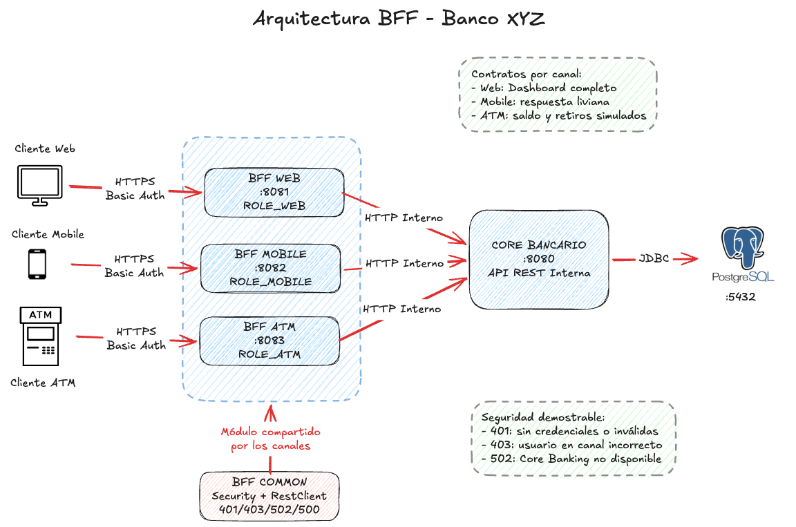
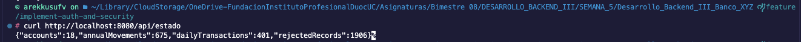
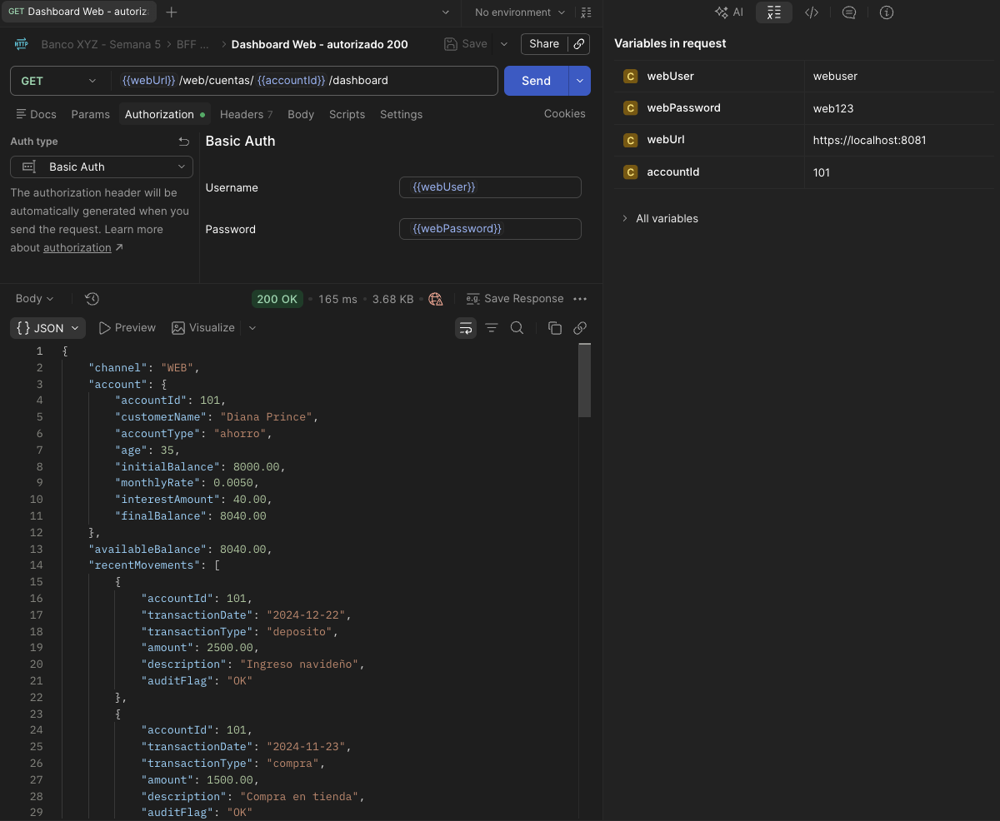
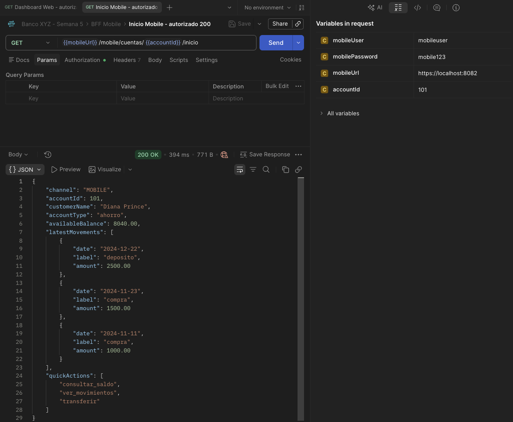
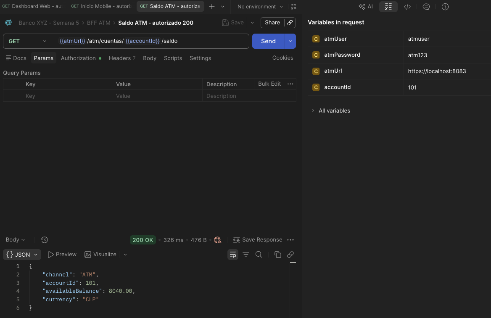
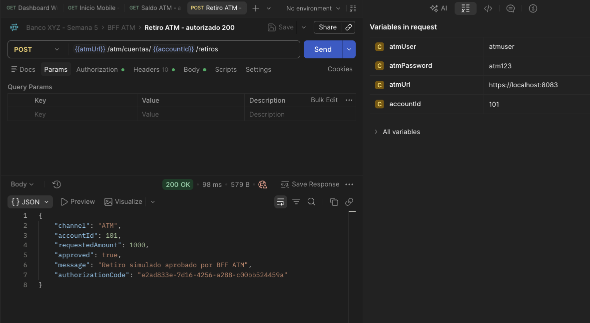
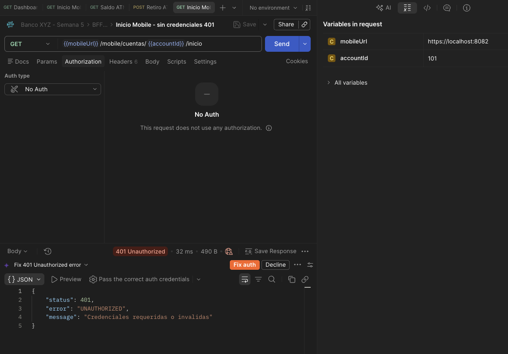
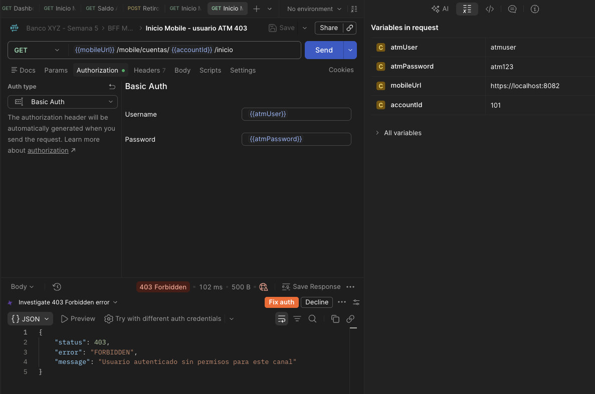
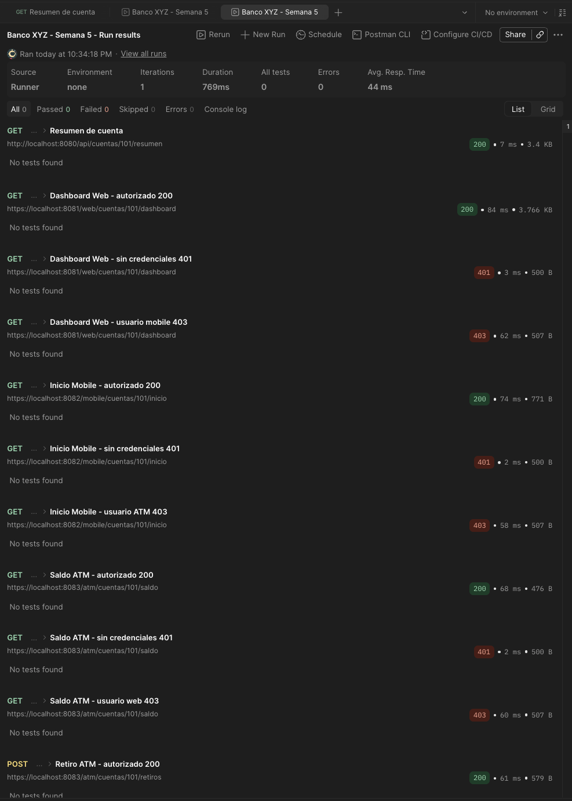

# Banco XYZ Spring Cloud Seguro

Proyecto formativo de Semana 6 para evolucionar el sistema Banco XYZ hacia una arquitectura de microservicios con **Spring Cloud Config Server**, **Eureka Service Discovery**, **Spring Cloud Gateway**, tolerancia a fallos con **Resilience4j** y seguridad con **Spring Security**.

El sistema mantiene el backend central con los datos procesados desde archivos legacy y los tres BFF independientes por canal construidos en Semana 5. En esta version, los servicios cargan configuracion centralizada, se registran en Eureka y pueden ser consumidos por un Gateway unico.

## Objetivo

Implementar una arquitectura distribuida para Banco XYZ usando Spring Cloud, manteniendo la separacion por canales BFF e incorporando configuracion centralizada, descubrimiento de servicios, entrada por Gateway, autenticacion/autorizacion y resiliencia ante fallas del backend central.

## Evolucion Semana 6

La actividad pide:

- Configurar un servidor centralizado de configuracion consumido por al menos un microservicio.
- Habilitar Service Discovery y registrar al menos un microservicio.
- Implementar un microservicio con tolerancia a fallos y autenticacion.

Este proyecto cumple esos puntos asi:

| Requisito | Implementacion |
| --- | --- |
| Config Server | Modulo `config-server` en puerto `8888`, con repositorio nativo en `config-repo`. |
| Service Discovery | Modulo `discovery-server` con Eureka en puerto `8761`. |
| Microservicio registrado | `core-banking`, `bff-web`, `bff-mobile`, `bff-atm` y `api-gateway`. |
| Tolerancia a fallos | Circuit Breaker en `bff-web` para el dashboard cuando `core-banking` no responde. |
| Seguridad | Spring Security con HTTP Basic y roles por canal, conservando respuestas `401` y `403`. |
| Gateway | Modulo `api-gateway` en puerto `8084`, enruta hacia los BFF mediante Eureka. |

## Estrategia BFF

La estrategia seleccionada es **un BFF por canal**. Esta decision permite separar contratos, respuestas y validaciones segun el tipo de cliente.

| Canal | BFF | Proposito |
| --- | --- | --- |
| Web | `bff-web` | Entregar una vista completa para navegadores, con saldo, datos de cuenta, movimientos y alertas operativas. |
| Mobile | `bff-mobile` | Entregar una respuesta liviana con datos esenciales, optimizada para menor consumo y carga rapida. |
| Cajero automatico | `bff-atm` | Entregar operaciones acotadas y seguras para consulta de saldo y retiro simulado. |

## Arquitectura



```text
Cliente / Postman
       |
       v
API Gateway :8084
       |
       +--> BFF WEB :8081 ----\
       +--> BFF MOBILE :8082 --+--> CORE BANKING :8080 --> PostgreSQL
       +--> BFF ATM :8083 ----/

Config Server :8888 --> configuracion centralizada
Eureka :8761        --> registro y descubrimiento de servicios
```

El flujo de cada BFF mantiene la separacion:

```text
Controller -> Service -> Client -> Core Banking
```

## Estructura del proyecto

```text
Desarrollo_Backend_III_Banco_XYZ/
|-- core-banking/    Backend central con Spring Batch, PostgreSQL y API REST
|-- bff-common/      RestClient compartido y seguridad comun de los BFF
|-- bff-web/         BFF para banca web
|-- bff-mobile/      BFF para app movil
|-- bff-atm/         BFF para cajeros automaticos
|-- config-server/   Configuracion centralizada Spring Cloud
|-- discovery-server/ Registro Eureka para descubrimiento de servicios
|-- api-gateway/     Entrada unica hacia los BFF con Spring Cloud Gateway
|-- postman/         Coleccion de prueba de APIs
|-- evidencias/      Capturas de ejecucion para la entrega
|-- scripts/         Script para certificado HTTPS de laboratorio
|-- docker-compose.yml
|-- pom.xml
```

Cada modulo BFF mantiene su logica propia en paquetes `controller`, `model`, `service` y `client`. El modulo `bff-common` concentra la configuracion tecnica reutilizable: `RestClient`, usuarios de laboratorio, autenticacion HTTP Basic, autorizacion por rol y respuestas `401/403`.

## Requisitos

- Java 17 o superior.
- Docker y Docker Compose.
- Maven Wrapper incluido en el proyecto.
- `keytool` disponible en el JDK.
- Postman para ejecutar la coleccion de validacion.

## Certificado HTTPS

Los BFF usan HTTPS con un certificado autofirmado de laboratorio. Para generarlo:

```bash
./scripts/generar-certificados.sh
```

El script copia `keystore.p12` a:

```text
bff-web/src/main/resources/
bff-mobile/src/main/resources/
bff-atm/src/main/resources/
```

La clave local del keystore es `changeit`. Es una credencial didactica y no debe usarse en produccion.

## Ejecucion

Desde la raiz del proyecto, levantar todos los servicios con Docker Compose:

```bash
docker compose up -d --build
```

El comando construye las imagenes cuando existen cambios y deja ejecutando PostgreSQL, Core Banking y los tres BFF.

Para revisar el estado de los contenedores:

```bash
docker compose ps
```

Para detener el ambiente:

```bash
docker compose down
```

Si se requiere eliminar tambien los datos locales de PostgreSQL:

```bash
docker compose down -v
```

Cada Dockerfile usa una etapa Maven para compilar el jar dentro de la imagen y una etapa final `eclipse-temurin:17-jre` para ejecutar el servicio. Por eso no es necesario empaquetar los modulos manualmente antes de usar Compose.

Puertos utilizados en Semana 6:

| Servicio | URL |
| --- | --- |
| Core Banking | `http://localhost:8080` |
| BFF Web | `https://localhost:8081` en ejecucion local directa, `http://localhost:8081` con Docker Compose |
| BFF Mobile | `https://localhost:8082` en ejecucion local directa, `http://localhost:8082` con Docker Compose |
| BFF ATM | `https://localhost:8083` en ejecucion local directa, `http://localhost:8083` con Docker Compose |
| API Gateway | `http://localhost:8084` |
| Config Server | `http://localhost:8888` |
| Eureka | `http://localhost:8761` |

En Docker Compose los BFF se ejecutan con `BFF_SSL_ENABLED=false` para que el Gateway pueda enrutar internamente por HTTP sin problemas de certificados autofirmados. La seguridad por usuario y rol se mantiene.

## Usuarios de laboratorio

| Usuario | Password | Rol | Canal |
| --- | --- | --- | --- |
| `webuser` | `web123` | `WEB` | Web |
| `mobileuser` | `mobile123` | `MOBILE` | Mobile |
| `atmuser` | `atm123` | `ATM` | Cajero automatico |

Las claves se pueden reemplazar con variables de entorno: `WEB_PASSWORD`, `MOBILE_PASSWORD` y `ATM_PASSWORD`.

## Seguridad

Cada BFF publica sus endpoints por HTTPS y valida credenciales con Spring Security. La autenticacion usa HTTP Basic y la autorizacion se define por rol:

| BFF | Ruta protegida | Rol requerido |
| --- | --- | --- |
| `bff-web` | `/web/**` | `WEB` |
| `bff-mobile` | `/mobile/**` | `MOBILE` |
| `bff-atm` | `/atm/**` | `ATM` |

Sin credenciales o con credenciales invalidas, el BFF responde `401 Unauthorized`. Con un usuario valido pero de otro canal, responde `403 Forbidden`.

## Pruebas

Ejecutar la suite completa:

```bash
./mvnw test
```

La coleccion Postman esta disponible en:

```text
postman/Banco_XYZ_Semana_5.postman_collection.json
postman/Banco_XYZ_Semana_6.postman_collection.json
```

## APIs Spring Cloud Semana 6

### Config Server

```bash
curl http://localhost:8888/bff-web/default
curl http://localhost:8888/core-banking/default
curl http://localhost:8888/api-gateway/default
```

### Eureka

Abrir en navegador:

```text
http://localhost:8761
```

Deberian aparecer, entre otros:

- `CORE-BANKING`
- `BFF-WEB`
- `BFF-MOBILE`
- `BFF-ATM`
- `API-GATEWAY`

### Gateway

Con Docker Compose:

```bash
curl -u webuser:web123 http://localhost:8084/gateway/web/cuentas/101/dashboard
curl -u mobileuser:mobile123 http://localhost:8084/gateway/mobile/cuentas/101/inicio
curl -u atmuser:atm123 http://localhost:8084/gateway/atm/cuentas/101/saldo
```

### Resiliencia

El endpoint web tiene Circuit Breaker:

```bash
curl -u webuser:web123 http://localhost:8084/gateway/web/cuentas/101/dashboard
```

Si `core-banking` no esta disponible, `bff-web` responde de forma degradada con:

```json
{
  "channel": "WEB",
  "backendStatus": "CORE_BANKING_NO_DISPONIBLE_CIRCUIT_BREAKER"
}
```

## API del core bancario

```bash
curl http://localhost:8080/api/estado
curl http://localhost:8080/api/cuentas
curl http://localhost:8080/api/cuentas/101
curl http://localhost:8080/api/cuentas/101/resumen
curl http://localhost:8080/api/cuentas/101/saldo
curl "http://localhost:8080/api/cuentas/101/movimientos?limit=5"
curl "http://localhost:8080/api/transacciones?onlyAnomalies=true&limit=5"
curl "http://localhost:8080/api/rechazos?limit=5"
```

## APIs BFF

### BFF Web

```bash
curl -k -u webuser:web123 https://localhost:8081/web/cuentas/101/dashboard
```

Con Docker Compose, usar HTTP porque el Gateway enruta por HTTP interno:

```bash
curl -u webuser:web123 http://localhost:8081/web/cuentas/101/dashboard
```

Respuesta esperada: dashboard con datos de cuenta, saldo disponible, ultimos movimientos, alertas y secciones visibles para web.

### BFF Mobile

```bash
curl -k -u mobileuser:mobile123 https://localhost:8082/mobile/cuentas/101/inicio
```

```bash
curl -u mobileuser:mobile123 http://localhost:8082/mobile/cuentas/101/inicio
```

Respuesta esperada: resumen liviano con saldo, datos principales de cuenta, ultimos movimientos y acciones rapidas.

### BFF ATM

```bash
curl -k -u atmuser:atm123 https://localhost:8083/atm/cuentas/101/saldo
```

```bash
curl -u atmuser:atm123 http://localhost:8083/atm/cuentas/101/saldo
```

```bash
curl -k -u atmuser:atm123 -X POST https://localhost:8083/atm/cuentas/101/retiros \
  -H "Content-Type: application/json" \
  -d '{"amount":1000,"pin":"1234"}'
```

Respuesta esperada: consulta de saldo o retiro simulado aprobado cuando el monto y el PIN cumplen las reglas del canal.

## Validaciones sugeridas

| Validacion | Resultado esperado |
| --- | --- |
| `./mvnw test` | `BUILD SUCCESS` |
| `GET /api/estado` | `200 OK` |
| Web sin credenciales | `401 Unauthorized` |
| Web con `webuser:web123` | `200 OK` |
| Web con `mobileuser:mobile123` | `403 Forbidden` |
| Mobile sin credenciales | `401 Unauthorized` |
| Mobile con `mobileuser:mobile123` | `200 OK` |
| Mobile con `atmuser:atm123` | `403 Forbidden` |
| ATM sin credenciales | `401 Unauthorized` |
| ATM con `atmuser:atm123` | `200 OK` |
| ATM con `webuser:web123` | `403 Forbidden` |
| Retiro ATM con usuario, monto y PIN valido | `200 OK` con retiro aprobado |

## Evidencia de ejecucion

Las capturas de `evidencias/` documentan la ejecucion del sistema y la validacion de los endpoints solicitados.

### Servicios levantados


### Pruebas automatizadas


### Core bancario



### BFF Web



### BFF Mobile



### BFF ATM





### Seguridad por canal





### Coleccion Postman


