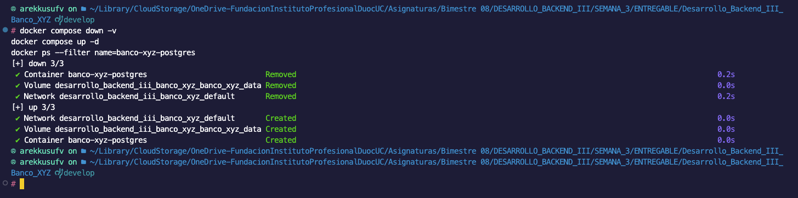
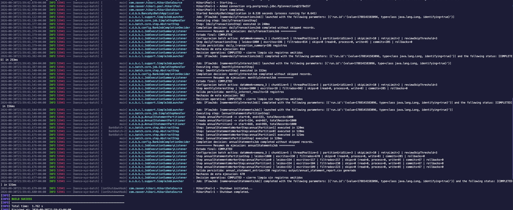
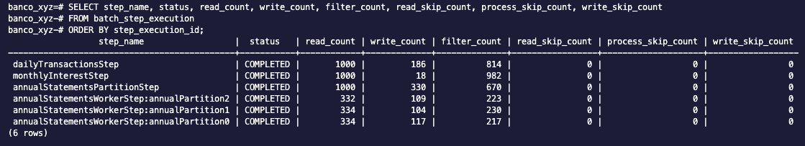
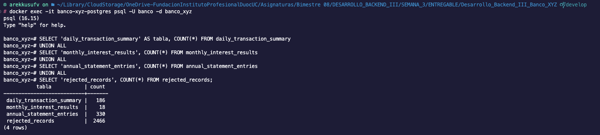
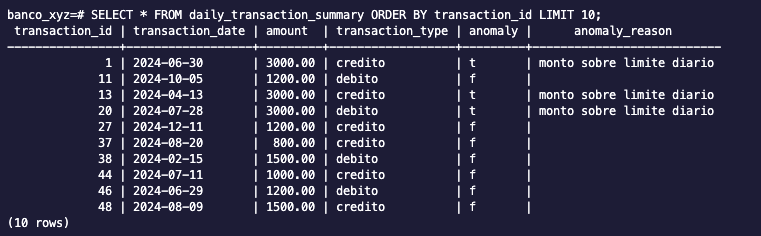
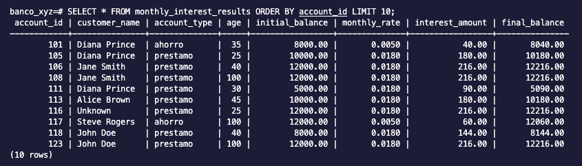
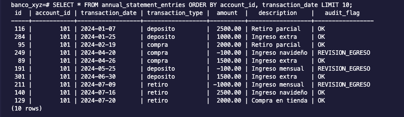
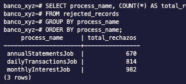
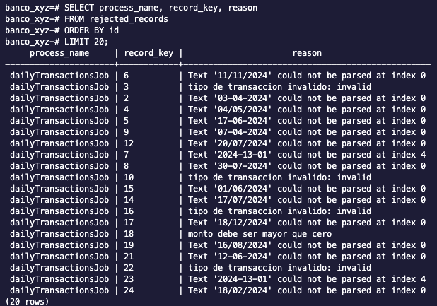

# Core Banking Banco XYZ

Backend central del proyecto Banco XYZ. Este servicio mantiene la solucion batch de Semana 3 y agrega una API REST para que los BFF de Semana 4 consuman datos procesados.

El proyecto procesa archivos CSV, valida datos inconsistentes, persiste resultados en PostgreSQL, registra rechazos auditables y aplica escalamiento mediante multithreading y particiones.

## Procesos

| Job | Entrada | Estrategia | Salida |
| --- | --- | --- | --- |
| `dailyTransactionsJob` | `transacciones.csv` | Chunks multithread | `daily_transaction_summary` |
| `monthlyInterestJob` | `intereses.csv` | Chunks multithread | `monthly_interest_results` |
| `annualStatementsJob` | `cuentas_anuales.csv` | Particiones manager/worker | `annual_statement_entries` y `output/annual_statement_report.csv` |

## Propuesta Tecnica

Cada proceso se implementa como un Job independiente para separar responsabilidades y facilitar trazabilidad.

Para transacciones diarias e intereses mensuales se usa procesamiento por chunks con `TaskExecutor`, ya que son procesos acotados a ventanas diaria y mensual. Para estados de cuenta anuales se usa particionamiento porque, en un escenario bancario real, el archivo anual concentra mayor volumetria al consolidar movimientos historicos por cuenta.

El flujo anual usa:

- `AnnualStatementPartitioner` para dividir `cuentas_anuales.csv` en rangos.
- `ExecutionContext` para entregar `start`, `end` y `partitionName` a cada worker.
- `annualStatementsWorkerStep` para procesar cada particion.
- `TaskExecutorPartitionHandler` para ejecutar workers en paralelo.

La tolerancia a fallos se concentra en `BankRecordSkipPolicy`, `BankSkipListener` y `BankJobCompletionDecider`. Los registros invalidos de negocio se guardan en `rejected_records`; los errores tecnicos controlados se tratan con `faultTolerant`, `skipPolicy` y `retry`.

## Configuracion

La mayor parte del comportamiento se puede ajustar en `core-banking/src/main/resources/application.properties` sin recompilar:

```properties
legacy.data.week=semana_3

batch.chunk-size=5
batch.thread-pool-size=3
batch.partition-grid-size=3
batch.skip-limit=10
batch.retry-limit=2
batch.review-skip-threshold=3

bank.transaction.anomaly-limit=2500
bank.transaction.valid-types=debito,credito

bank.interest.monthly-rates=ahorro:0.0050,prestamo:0.0180
bank.interest.min-age=18
bank.interest.max-age=100

bank.annual.valid-transaction-types=deposito,retiro,compra,pago
bank.annual.negative-amount-audit-flag=REVISION_EGRESO
bank.annual.default-audit-flag=OK
bank.annual.report-output=output/annual_statement_report.csv

bank.rejected.process-name-limit=80
bank.rejected.record-key-limit=120
bank.rejected.reason-limit=255
```

La base de datos usa PostgreSQL:

```properties
spring.datasource.url=jdbc:postgresql://localhost:5432/banco_xyz
spring.datasource.username=banco
spring.datasource.password=banco
```

## Ejecucion

Requisitos:

- Java 17 o superior.
- Docker Desktop o Docker Compose.
- Puerto local `5432` disponible.

Levantar PostgreSQL y ejecutar:

```bash
docker compose up -d
./mvnw -pl core-banking spring-boot:run
```

Al iniciar, la aplicacion ejecuta los procesos batch y deja disponible la API REST del core bancario en `http://localhost:8080`.

Para procesar otra semana:

```bash
./mvnw -pl core-banking spring-boot:run -Dspring-boot.run.arguments="--legacy.data.week=semana_1"
```

## Validaciones

El sistema valida:

- Fechas con formato `yyyy-MM-dd`, `yyyy/MM/dd`, `dd-MM-yyyy` o `dd/MM/yyyy`.
- Montos nulos, cero o negativos segun regla del proceso.
- Tipos validos de transaccion, cuenta y movimiento.
- Duplicados por clave natural. En transacciones diarias la clave incluye el identificador para no descartar movimientos distintos que coincidan en fecha, monto y tipo.
- Edades fuera del rango configurado.
- Egresos anuales, marcados con flag de auditoria.

Los rechazos se almacenan en `rejected_records` con proceso, clave, motivo y payload original.

## Verificacion

Ejecutar pruebas automatizadas:

```bash
./mvnw -pl core-banking test
```

Consultar la API REST del core bancario:

```bash
curl http://localhost:8080/api/estado
curl http://localhost:8080/api/cuentas
curl http://localhost:8080/api/cuentas/101
curl http://localhost:8080/api/cuentas/101/resumen
curl http://localhost:8080/api/cuentas/101/saldo
curl "http://localhost:8080/api/cuentas/101/movimientos?limit=5"
curl "http://localhost:8080/api/transacciones?onlyAnomalies=true&limit=5"
curl "http://localhost:8080/api/rechazos?limit=5"
```

Estos endpoints forman el core bancario que consumiran los BFF Web, Mobile y ATM.

Consultar resultados en PostgreSQL:

```bash
docker exec -it banco-xyz-postgres psql -U banco -d banco_xyz
```

```sql
SELECT COUNT(*) FROM daily_transaction_summary;
SELECT COUNT(*) FROM monthly_interest_results;
SELECT COUNT(*) FROM annual_statement_entries;
SELECT COUNT(*) FROM rejected_records;
```

La consola muestra el resumen de cada Job. En el proceso anual deben verse las particiones:

```text
Creada annualPartition0 -> start=0, end=333, totalRecords=1000
Creada annualPartition1 -> start=334, end=667, totalRecords=1000
Creada annualPartition2 -> start=668, end=999, totalRecords=1000
```

Y los workers paralelos:

```text
annualStatementsWorkerStep:annualPartition0
annualStatementsWorkerStep:annualPartition1
annualStatementsWorkerStep:annualPartition2
```

## Comparacion de rendimiento

La configuracion de escalamiento se puede comparar sin cambiar codigo, usando argumentos de Spring Boot:

```bash
./mvnw -pl core-banking spring-boot:run -Dspring-boot.run.arguments="--batch.chunk-size=5 --batch.thread-pool-size=3 --batch.partition-grid-size=3"
./mvnw -pl core-banking spring-boot:run -Dspring-boot.run.arguments="--batch.chunk-size=3 --batch.thread-pool-size=3 --batch.partition-grid-size=3"
./mvnw -pl core-banking spring-boot:run -Dspring-boot.run.arguments="--batch.chunk-size=10 --batch.thread-pool-size=4 --batch.partition-grid-size=4"
```

Tambien se incluye un script para registrar la comparacion en CSV:

```bash
./core-banking/scripts/run-performance-comparison.sh
```

El resultado queda en `output/performance-comparison.csv` con escenario, parametros usados y duracion total. La configuracion recomendada para la entrega es `chunk-size=5`, `thread-pool-size=3` y `partition-grid-size=3`, porque mantiene paralelismo visible sin sobrecargar la base local.

## Evidencias

Las evidencias de ejecucion se encuentran en `screenshots/`.

### Ambiente limpio



### Ejecucion batch Semana 3



### Metadata de Spring Batch



### Conteos finales



### Datos procesados







### Rechazos auditados





El reporte anual se genera en `output/annual_statement_report.csv`.

## Estructura

```text
core-banking/src/main/java/cl/duoc/backendiii/bankbatch
|-- config       Jobs, Steps, runner y resumen de ejecucion
|-- domain       Modelos de entrada y salida
|-- listener     Registro de skips tecnicos
|-- partition    Particionamiento del proceso anual
|-- policy       Politica personalizada de skip
|-- processor    Validaciones y transformaciones
|-- reader       Lectura CSV
|-- writer       Escritura de reporte anual
```
